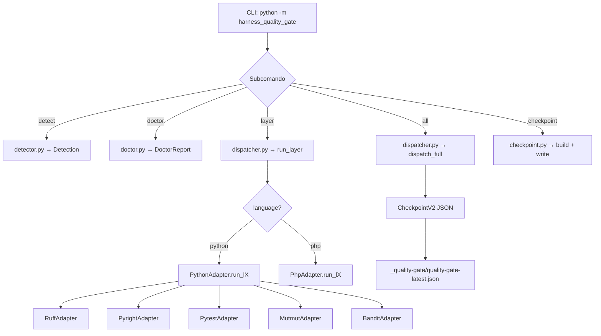
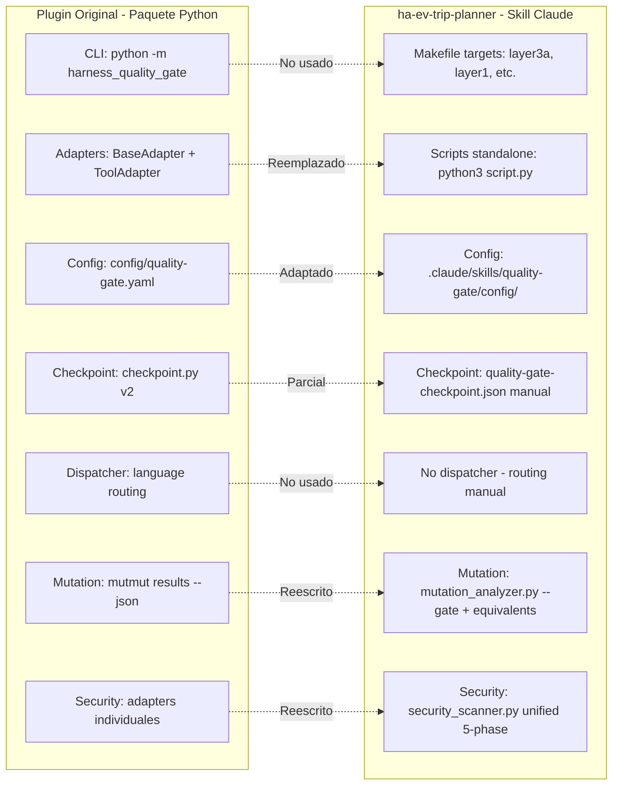

# Informe: Plugin harness-quality-gate — Comparativa Plugin vs Proyecto ha-ev-trip-planner

## 1. Resumen Ejecutivo

El plugin **harness-quality-gate** es un sistema de quality gate poliglota (Python + PHP) diseñado para agentes de codificación autónomos (patrón Ralph Loop). Implementa una validación de 5 capas (L3A→L1→L2→L3B→L4) con enfoque Two-Tier (Tier A AST determinista + Tier B BMAD Party Mode consensuado).

El proyecto **ha-ev-trip-planner** ha instalado una copia del skill dentro de `.claude/skills/quality-gate/` y la ha **personalizado significativamente** para adaptarse a su dominio (Home Assistant custom component). Las modificaciones van desde ajustes de configuración hasta scripts completamente reescritos.

---

## 2. Arquitectura del Plugin (Repositorio Original)

### 2.1 Estructura del Paquete Python

```
harness_quality_gate/
├── __init__.py, __main__.py, cli.py          # CLI con subcomandos (detect, doctor, layer, all, checkpoint)
├── config.py                                  # Carga YAML v2, validación de thresholds
├── configurator.py                            # Genera config stubs (quality-gate.yaml, infection.json5, etc.)
├── detector.py                                # Detección de lenguaje 3-tier (.quality-gate-lang > manifest > file count)
├── dispatcher.py                              # Routing lenguaje→adapter, dispatch_full()
├── checkpoint.py                              # Builder + writer de checkpoint v2 JSON (atomic write)
├── models.py                                  # 11 dataclasses congeladas (Detection, Finding, LayerResult, etc.)
├── doctor.py                                  # Diagnóstico de runtime + herramientas
├── installer.py                               # Instalación composer-local + fallback PHAR
├── concurrency.py, exit_codes.py, state.py
├── messages_es.py, messages_fr.py             # i18n
├── adapters/
│   ├── base.py                                # BaseAdapter (ABC) + ToolAdapter (ABC) + subprocess runner
│   ├── python/
│   │   ├── python_adapter.py                  # Orquestador: ruff, pyright, pytest, mutmut, bandit, vulture, deptry
│   │   ├── ruff_adapter.py                    # ruff check --output-format=json
│   │   ├── pyright_adapter.py                 # pyright --outputjson
│   │   ├── pytest_adapter.py                  # pytest --junitxml
│   │   ├── mutmut_adapter.py                  # mutmut results --json
│   │   ├── bandit_adapter.py                  # bandit -r --format json
│   │   ├── vulture_adapter.py                 # vulture
│   │   ├── deptry_adapter.py                  # deptry
│   │   ├── weak_test.py                       # A1-A9 AST visitor (Strategy pattern)
│   │   ├── antipattern_tier_a.py              # 22 antipatterns AST (AP01-AP39)
│   │   ├── solid_metrics.py                   # SOLID Tier A (SRP, OCP, LSP, ISP, DIP)
│   │   └── principles.py                      # DRY, KISS, YAGNI, LoD, CoI
│   ├── php/
│   │   ├── php_adapter.py                     # Orquestador PHP
│   │   ├── phpstan_adapter.py, phpmd_adapter.py, etc.
│   │   └── visitors/ (PHP AST visitors)
│   └── shared/
│       ├── gitleaks_adapter.py, semgrep_adapter.py
│       ├── checkov_adapter.py, trivy_adapter.py
├── bmad/
│   ├── weak_test_engine.py                    # Strategy pattern base (WeakTestEngine ABC)
│   ├── mutation_analyzer.py                   # Parse mutmut/infection → ModuleMutStats
│   ├── antipattern_judge.py                   # Genera contexto Tier B para BMAD
│   ├── llm_solid_judge.py                     # Genera contexto SOLID Tier B para BMAD
│   └── diversity_metric.py                    # Levenshtein distance entre test bodies
```

### 2.2 Configuración por Defecto

Ubicada en [`config/quality-gate.yaml`](config/quality-gate.yaml). Parámetros clave:

| Capa | Parámetro | Valor Default |
|------|-----------|---------------|
| L1 | `coverage_threshold` | 85.0 |
| L1 | `mutation_kill_threshold` | 0.70 (global fallback) |
| L1 | `e2e.mandatory` | **false** |
| L2 | `max_assertions_single` (A1) | 1 |
| L2 | `min_assertions` (A2) | 3 |
| L2 | `max_mock_ratio` (A4) | 0.8 |
| L3 | `srp.max_public_methods` | 7 |
| L3 | `kiss.max_function_complexity` | 10 |
| L4 | `severity_threshold` | high |
| L4 | `bandit.targets` | `src`, `scripts` |
| L4 | `semgrep.configs` | `p/security-audit`, `p/owasp-top-ten`, + reglas custom |
| Output | `folder` | `_quality-gate` |

### 2.3 Flujo de Ejecución del Plugin



---

## 3. Adaptación en ha-ev-trip-planner

### 3.1 Estructura del Skill Instalado

```
.claude/skills/quality-gate/
├── SKILL.md                                    # Skill descriptor (Claude Code)
├── workflow.md
├── config/quality-gate.yaml                    # Config adaptada al proyecto
├── scripts/                                    # Scripts Python standalone
│   ├── antipattern_checker.py                  # Versión standalone (no adapter)
│   ├── antipattern_judge.py
│   ├── configurator.py
│   ├── diversity_metric.py
│   ├── layer3a_summary.py                      # NUEVO: resume resultados L3A
│   ├── llm_solid_judge.py
│   ├── mutation_analyzer.py                    # REESCRITO: per-module + equivalent-mutants
│   ├── principles_checker.py
│   ├── security_scanner.py                     # REESCRITO: unified scanner con 5 fases
│   ├── solid_metrics.py
│   └── weak_test_detector.py
├── steps/                                      # Workflow steps
├── references/                                 # Documentación de referencia
│   ├── semgrep-ha-rules.yaml                   # Reglas HA-specific
│   ├── semgrep-js-rules.yaml
│   ├── semgrep-python-rules.yaml
│   └── home-assistant/semgrep-ha-rules.yaml
└── quality-gate/                               # Sub-copia anidada (legacy)
    ├── SKILL.md, workflow.md
    ├── config/quality-gate.yaml
    ├── scripts/ (duplicados)
    └── references/
```

### 3.2 Cambios Clave en la Configuración

Comparando [`config/quality-gate.yaml`](config/quality-gate.yaml) del plugin vs `.claude/skills/quality-gate/config/quality-gate.yaml` del proyecto:

| Parámetro | Plugin Original | Proyecto ha-ev-trip-planner | Impacto |
|-----------|----------------|----------------------------|---------|
| `layer1.e2e.mandatory` | **false** | **true** | E2E es OBLIGATORIO — falla L1 si `make e2e` falla |
| `layer4.tools.bandit.targets` | `src`, `scripts` | `custom_components`, `scripts` | Apuntado al namespace HA |
| `layer4.tools.semgrep.configs` | Referencia `${CLAUDE_SKILL_DIR}` | Referencia `{skill-root}` | Diferente variable de resolución |
| `output.folder` | `_quality-gate` | `_bmad-output/quality-gate` | Integración con BMAD output |
| `layer4.tools.deptry.known_first_party` | No configurado | `custom_components` (comentado) | Reconoce namespace HA |

### 3.3 Cambios Clave en Scripts

#### 3.3.1 `mutation_analyzer.py` — Reescritura Completa

| Aspecto | Plugin Original | Proyecto |
|---------|----------------|----------|
| **Fuente de datos** | `mutmut results --json` (JSON parse) | `mutmut results --all true` (text parse) |
| **Extracción de módulo** | Regex `MUTMUT_DOTTED_PATH` | Split por `.` + lógica específica `custom_components.ev_trip_planner.<module>` |
| **Modo gate** | No existe | `--gate` flag: compara contra `[tool.quality-gate.mutation]` en `pyproject.toml` |
| **Equivalentes** | No soportado | `parse_equivalents()`: lee `specs/mutation-score-ramp/equivalent-mutants.md` |
| **Kill rate** | `killed / covered` | `killed / (killed + survived + timeout + runtime_error)` — excluye `no_tests` |
| **Per-module thresholds** | No | Sí: lee `[tool.quality-gate.mutation.modules.<name>]` con `kill_threshold`, `status`, `increment_step` |
| **Unregistered survivors** | No | `fail_on_unregistered_survivor = true` en config |
| **Venv handling** | `shutil.which("mutmut")` | `. .venv/bin/activate && mutmut results --all true` (shell=True) |

#### 3.3.2 `security_scanner.py` — Reescritura Completa

| Aspecto | Plugin Original (adapters) | Proyecto (script standalone) |
|---------|---------------------------|------------------------------|
| **Arquitectura** | Adapters individuales (BanditAdapter, etc.) | Scanner unificado con 5 fases |
| **Fase 1** | Cada adapter corre independientemente | Deterministic scan (todos los tools) |
| **Fase 2** | No existe | CWE dedup + confidence scoring |
| **Fase 3** | No existe | LLM triage (TRUE_POSITIVE / FALSE_POSITIVE / NEEDS_CONSENSUS) |
| **Fase 4** | No existe | Party Mode consensus (Winston + Murat + Amelia) |
| **Fase 5** | No existe | Fix validation loop |
| **CWE Mapping** | Básico en BanditAdapter | Tabla completa: `BANDIT_CWE_MAP`, `SEMGREP_CWE_MAP`, `GITLEAKS_CWE` |
| **Dedup** | No | `dedup_findings()` con `line_tolerance=5`, `cross_validation_bonus=0.3` |
| **HA-specific** | No | Reglas semgrep HA custom, `--exclude-rule` para FPs de HA |

#### 3.3.3 Scripts Adicionales del Proyecto

| Script | Descripción | Equivalente en Plugin |
|--------|-------------|----------------------|
| `layer3a_summary.py` | Resume resultados antipattern en formato legible | No existe |
| `antipattern_checker.py` | Versión standalone (no usa BaseAdapter) | `antipattern_tier_a.py` (adapter) |
| `principles_checker.py` | Versión standalone | `principles.py` (adapter) |
| `solid_metrics.py` | Versión standalone | `solid_metrics.py` (adapter) |
| `weak_test_detector.py` | Versión standalone | `weak_test.py` (adapter) |
| `configurator.py` | Genera config stubs | `configurator.py` (módulo del paquete) |

### 3.4 Integración vía Makefile

El proyecto **no usa el CLI del plugin** (`python -m harness_quality_gate`). En su lugar, implementa las capas directamente en el [`Makefile`](/mnt/bunker_data/ha-ev-trip-planner/ha-ev-trip-planner/Makefile):

```makefile
# L3A: ruff + pylint + pyright + solid_metrics.py + principles_checker.py + antipattern_checker.py
layer3a:
    .venv/bin/ruff check custom_components/
    .venv/bin/pylint custom_components/ tests/unit/ tests/integration/
    $(MAKE) typecheck
    python3 .claude/skills/quality-gate/scripts/solid_metrics.py custom_components/
    python3 .claude/skills/quality-gate/scripts/principles_checker.py custom_components/
    python3 .claude/skills/quality-gate/scripts/antipattern_checker.py custom_components/ custom_components/

# L1: pytest + E2E (OBLIGATORIO)
layer1:
    $(MAKE) test
    $(MAKE) e2e
    $(MAKE) e2e-soc

# L2: mutmut run + mutation_analyzer.py --gate + weak_test + diversity
layer2:
    .venv/bin/mutmut run --max-children=$(MUTATION_MAX_CHILDREN)
    .venv/bin/python .claude/skills/quality-gate/scripts/mutation_analyzer.py . --gate
    .venv/bin/python .claude/skills/quality-gate/scripts/weak_test_detector.py tests/ custom_components/
    .venv/bin/python .claude/skills/quality-gate/scripts/diversity_metric.py tests/

# L3B: llm_solid_judge.py + antipattern_judge.py (contexto para BMAD)
layer3b:
    .venv/bin/python .claude/skills/quality-gate/scripts/llm_solid_judge.py custom_components/
    .venv/bin/python .claude/skills/quality-gate/scripts/antipattern_judge.py custom_components/ tests/

# L4: security_scanner.py (unified, 8 tools)
layer4:
    .venv-314-clean/bin/python .claude/skills/quality-gate/scripts/security_scanner.py . --severity-threshold high --verbose
```

### 3.5 Per-Module Mutation Thresholds en pyproject.toml

El proyecto define thresholds incrementales por módulo — algo que el plugin original no soporta:

```toml
[tool.quality-gate.mutation]
global_kill_threshold = 0.48
fail_on_missing_module = false
increment_step = 0.01
target_final = 1.00
modules_per_sprint = 2
fail_on_unregistered_survivor = true

[tool.quality-gate.mutation.modules.calculations]
kill_threshold = 0.789
status = "passing"

[tool.quality-gate.mutation.modules.helpers]
kill_threshold = 0.30
status = "in_progress"
increment_step = 0.05
```

---

## 4. Comparativa de Enfoques

### 4.1 Diagrama de Divergencia



### 4.2 Tabla Comparativa Detallada

| Dimensión | Plugin Original | Proyecto ha-ev-trip-planner |
|-----------|----------------|----------------------------|
| **Distribución** | Paquete Python instalable (`pyproject.toml`) | Skill Claude Code (`.claude/skills/`) |
| **Ejecución** | CLI con subcomandos | Makefile targets |
| **Arquitectura** | OOP: adapters con herencia (BaseAdapter/ToolAdapter) | Scripts procedurales standalone |
| **Lenguajes** | Python + PHP (polyglot) | Solo Python (HA custom component) |
| **Detección de lenguaje** | 3-tier automática (`.quality-gate-lang` > manifest > file count) | Hardcodeado Python |
| **E2E** | Opcional (`mandatory: false`) | Obligatorio (`mandatory: true`) |
| **Mutation testing** | Básico: `mutmut results --json` → `MutationStats` | Avanzado: per-module gate, equivalent-mutants registry, unregistered survivor check |
| **Security L4** | Adapters individuales sin dedup | Scanner unificado 5-fase con CWE dedup, confidence scoring, LLM triage, Party Mode |
| **Checkpoint** | Automático vía `checkpoint.py` (atomic write, schema validation) | Manual: `quality-gate-checkpoint.json` generado ad-hoc |
| **Config** | Centralizada en `config/quality-gate.yaml` | Split: YAML + `pyproject.toml` [tool.quality-gate.mutation] |
| **Paralelismo** | `concurrency.py` con detección CI | `SAFE_PARALLEL=parallel` en Makefile |
| **i18n** | Español + Francés | Solo español (comentarios Makefile) |
| **Test del plugin** | Suite completa: unit, integration, e2e | No testea el skill en sí |
| **HA-specific** | Reglas semgrep HA como opt-in | Reglas HA integradas + exclude de FPs conocidos |
| **Source targets** | `src/` | `custom_components/ev_trip_planner/` |
| **Coverage** | 85% default | 100% (`fail_under = 100` en pyproject.toml) |

---

## 5. Hallazgos Clave

### 5.1 El Proyecto No Usa el Paquete Python

El proyecto ha-ev-trip-planner **no importa ni ejecuta** el paquete `harness_quality_gate`. En su lugar:
- Copió los scripts Python relevantes a `.claude/skills/quality-gate/scripts/`
- Los reescribió como scripts standalone (sin dependencia de `BaseAdapter`, `ToolAdapter`, `models.py`, etc.)
- Los invoca directamente desde el Makefile

### 5.2 Divergencia Arquitectónica

El plugin usa un **patrón Adapter OOP** con clases abstractas, inyección de herramientas y routing por lenguaje. El proyecto usa un **patrón Script Procedural** donde cada capa es un target de Makefile que ejecuta scripts Python directamente.

### 5.3 Mejoras del Proyecto que No Están en el Plugin

1. **Mutation gate con per-module thresholds**: El `mutation_analyzer.py` del proyecto soporta `--gate` con thresholds por módulo desde `pyproject.toml`, registro de equivalentes, y detección de supervivientes no registrados. El plugin solo parsea JSON básico.

2. **Security scanner unificado 5-fase**: El `security_scanner.py` del proyecto implementa dedup por CWE, confidence scoring, LLM triage, Party Mode consensus y fix validation loop. El plugin tiene adapters individuales sin coordinación.

3. **Equivalent-mutants registry**: Sistema de registro de mutantes equivalentes con justificación (`specs/mutation-score-ramp/equivalent-mutants.md`). No existe en el plugin.

4. **Incremental mutation ramp**: `increment_step`, `target_final`, `modules_per_sprint` para subir thresholds gradualmente. No existe en el plugin.

5. **`layer3a_summary.py`**: Resumen legible de resultados antipattern. No existe en el plugin.

### 5.4 Capacidades del Plugin No Usadas en el Proyecto

1. **CLI con subcomandos**: `detect`, `doctor`, `install-tools`, `audit-ignores`, `configure`
2. **Detección automática de lenguaje**: El proyecto hardcodea Python
3. **Soporte PHP**: Completo en el plugin, irrelevante para el proyecto
4. **Checkpoint automático con schema validation**: El plugin genera checkpoints con atomic write y validación JSON Schema. El proyecto genera un JSON manual.
5. **Configurator**: Genera stubs de configuración automáticamente
6. **Doctor**: Diagnostica herramientas faltantes
7. **i18n**: Mensajes en español y francés
8. **Concurrency plan**: Detección CI vs local con workers adaptativos

---

## 6. Recomendaciones

### 6.1 Para el Plugin (Upstream)

1. **Incorporar mutation gate con per-module thresholds**: La funcionalidad de `--gate` con thresholds desde `pyproject.toml` y registro de equivalentes es significativamente más avanzada que el `MutmutAdapter` actual.

2. **Incorporar security scanner unificado**: Las 5 fases (deterministic → dedup → LLM triage → Party Mode → fix validation) son un salto cualitativo vs los adapters individuales.

3. **Hacer los adapters opcionales**: Permitir usar scripts standalone como alternativa al paquete OOP, facilitando adopción incremental.

4. **Soportar `custom_components/` como source dir**: Actualmente solo prevé `src/`.

### 6.2 Para el Proyecto ha-ev-trip-planner

1. **Considerar usar el CLI del plugin**: Los subcomandos `detect`, `doctor`, y `checkpoint` aportan valor sin reinvención.

2. **Eliminar la copia anidada**: Existe `.claude/skills/quality-gate/quality-gate/` (sub-copia legacy) que debería eliminarse.

3. **Contribuir mejoras upstream**: El mutation gate y el security scanner unificado son mejoras que beneficiarían a todos los usuarios del plugin.

---

## 7. Conclusión

El proyecto ha-ev-trip-planner tomó el skill harness-quality-gate como **punto de partida** y lo evolucionó de forma significativa en dos áreas clave: **mutation testing con per-module gates** y **security scanning unificado con 5 fases**. Sin embargo, esta evolución se hizo **fuera del paquete Python**, copiando y reescribiendo scripts como standalone, lo que crea una bifurcación de mantenimiento. Las mejoras del proyecto representan avances sustanciales que deberían integrarse upstream en el plugin para evitar divergencia permanente.
