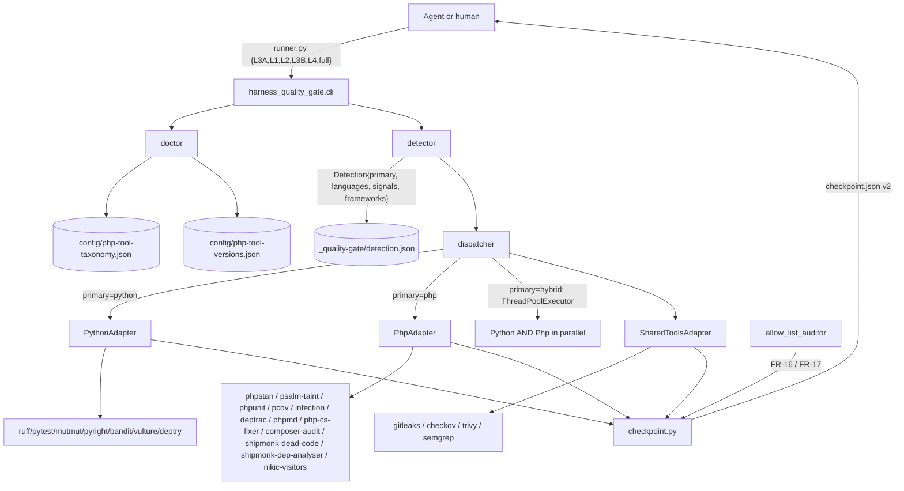
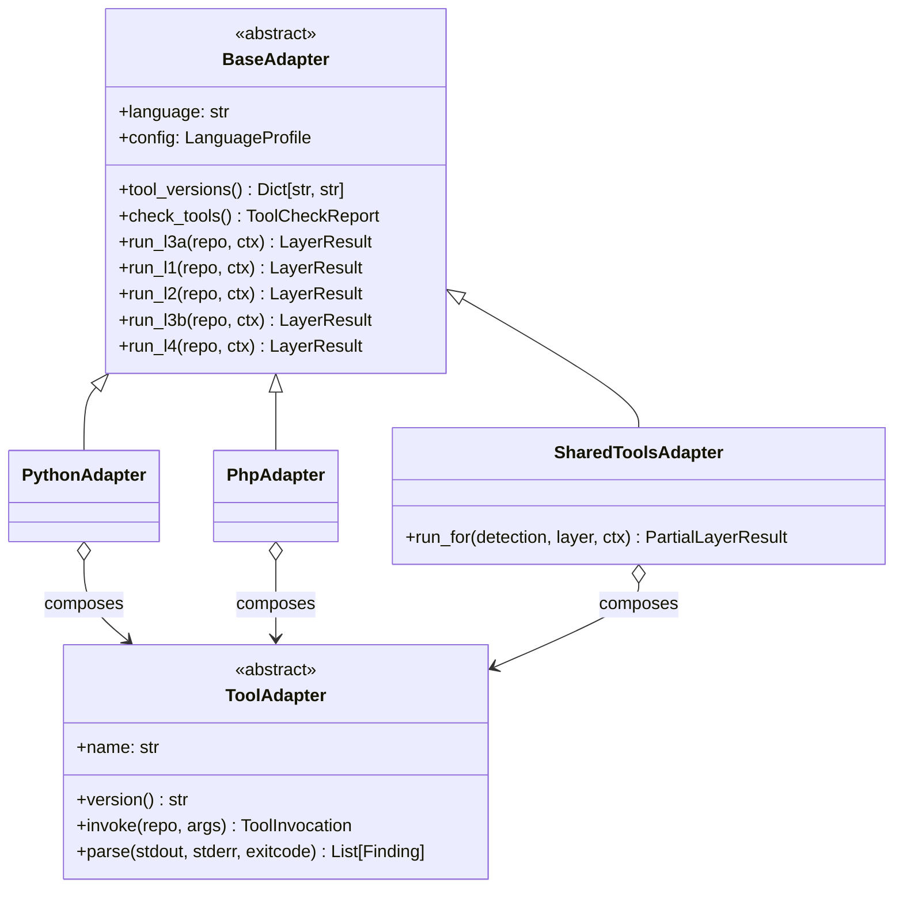
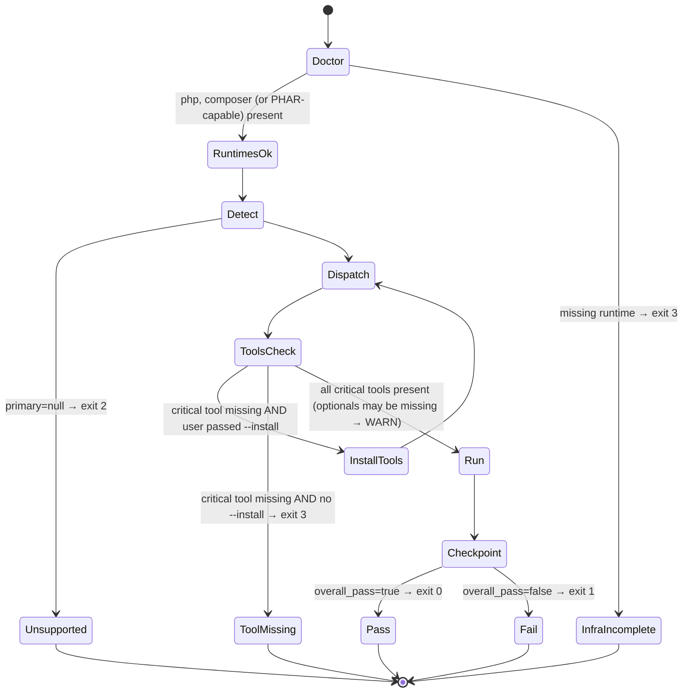

# Design: php-support

## Overview

Port the Python-only `harness-quality-gate` skill to a polyglot Python+PHP gate
that auto-detects the project language and dispatches each of the five layers
(L3A → L1 → L2 → L3B → L4) to language-specific adapters, emitting a unified
**Checkpoint v2** JSON contract. The architecture is a single Python
orchestrator (`harness_quality_gate/`) driving all PHP tooling via subprocess
(PHPStan, Psalm-taint, PHPUnit, Infection, Deptrac, PHPMD, PHP-CS-Fixer,
composer audit, security-checker, shipmonk dead-code, shipmonk dep-analyser);
the only `.php` sources shipped are `nikic/PHP-Parser` AST visitors for the
~12 Tier A antipatterns PHPMD does not cover.

Key shifts vs the current Python-only skill: (1) the legacy `scripts/*.py`
flat layout, the `{skill-root}` placeholder, and the v1 flat YAML config are
removed wholesale (no BC — FR-32/33/34) and replaced by an installable Python
package `harness_quality_gate/` with `adapters/base.py` ABC + per-language
subpackages; (2) detection becomes an executable component
(`detector.py`) cached in `_quality-gate/detection.json` and consumed by every
subcommand; (3) the **Infection 100/100 hard gate** is governed by a
**Justified-Ignore Allow-List** policy enforced by a standalone
`audit-ignores` subcommand backed by `allow_list_auditor` adapter; (4) the
checkpoint JSON v2 contract gets top-level `language`, per-layer `language`,
per-finding `language`, and `per_language` sub-blocks for hybrid repos.

What is new vs reused: ~55% of the current logic (orchestration, BMAD judges,
diversity metric, references, workflow sequence) is preserved but relocated
into the new package layout; ~45% (AST-bound Tier A engines, security
scanner orchestration, mutation analyzer) is reshaped behind the
`BaseAdapter` ABC seam. Concurrency follows a `--concurrency
[parallel|sequential|auto]` flag where `auto` parallelizes locally and
serializes in CI (auto-detected via `CI=true`/`GITHUB_ACTIONS`/`GITLAB_CI`
env vars). PHARs install to `~/.cache/harness-quality-gate/bin/`
(XDG-compliant, always writable).

---

## Goals & Non-Goals

### Goals

- G1. Single-install polyglot skill auto-detecting Python / PHP / hybrid per
  project (FR-1 … FR-5, FR-41/42).
- G2. Same 5-layer gate against PHP with PHP-equivalent tools (FR-6 … FR-10,
  FR-19, FR-21, FR-35).
- G3. Infection 100/100 HARD gate + Justified-Ignore Allow-List auditing
  (FR-13 … FR-18).
- G4. Unified Checkpoint v2 JSON contract with per-language denormalization
  (FR-24, FR-25, US-10, US-13).
- G5. Spanish end-user copy + English code identifiers (FR-38, US-18).
- G6. Deterministic, pinned PHP tool install via composer OR PHAR fallback
  with SHA-256 verification (FR-29, FR-30, FR-31, FR-45).
- G7. Doctor subcommand emitting `INFRA_INCOMPLETE` distinct from `FAIL`
  (FR-26, FR-27, NFR-10, NFR-15).
- G8. Configurable concurrency: parallel-by-default locally, sequential in CI
  (design interview lock).
- G9. Clean v2.0.0 cut-over — no BC, no `{skill-root}` aliases, no
  `legacy_shims/`, no `MIGRATION.md` (FR-32, FR-33, FR-34, US-16).

### Non-Goals (v1)

- N1. TypeScript / JavaScript / Go / Rust / Ruby / Java / .NET language
  support.
- N2. Auto-fixing of violations (Rector/PHPCBF/ruff `--fix`). Detection only.
- N3. IDE integrations (VSCode/PhpStorm/IntelliJ).
- N4. Cross-language finding deduplication for hybrid repos.
- N5. Per-mutator inline `@infection-ignore-for <Mutator>` (Infection issue
  #2291 — feature not yet stable).
- N6. Bundling PHARs inside the skill artifact.
- N7. Cross-skill dependencies (Claude Code issue #9444).
- N8. Auto-installing PHP / Composer runtimes — doctor only reports.
- N9. Web UI / TUI / dashboards. JSON files only.
- N10. Notifications (Slack / PR comments). CI integrations live outside.

---

## Architecture Diagram

### High-level: orchestrator + adapters + checkpoint



### L1 PHP sequence (PCOV with Xdebug fallback + Infection)

```mermaid
sequenceDiagram
    autonumber
    participant Disp as Dispatcher
    participant Php as PhpAdapter.run_l1
    participant Cov as pcov_adapter
    participant PU as phpunit_adapter
    participant Inf as infection_adapter
    participant Allow as allow_list_auditor
    participant Ck as checkpoint.py

    Disp->>Php: run_l1(detection, config)
    Php->>Cov: probe()
    alt PCOV present
        Cov-->>Php: driver=pcov
    else
        Cov-->>Php: fallback=xdebug + WARNING
    end
    Php->>PU: invoke (strict-mode flags, --coverage-php)
    PU-->>Php: junit.xml + coverage.php
    alt mutate_plugin_present OR phpunit-only project
        Php->>Inf: --threads=max --git-diff-lines + --coverage=var/coverage --skip-initial-tests
        Inf-->>Php: infection-log.json (stats, escaped[], notCovered[])
    else Pest detected without pest-plugin-mutate
        Php-->>Php: SKIP mutation; mark mutation_skipped="pest-plugin-mutate missing"
    end
    Php->>Allow: audit(ignores_in_repo vs git HEAD)
    Allow-->>Php: ignored_count, ignored_delta, unjustified_new[]
    Php->>Ck: LayerResult(layer=L1, language=php, tool_specific.infection={...})
    Ck-->>Disp: appended
```

### Adapter class hierarchy



### Doctor → detect → install → run lifecycle



---

## Component Responsibilities

| Component | File | Responsibility | Public API |
|-----------|------|----------------|------------|
| `cli` | `harness_quality_gate/cli.py` | argparse subcommand surface (`detect`, `doctor`, `install-tools`, `audit-ignores`, `configure`, `layer3a`, `layer1`, `layer2`, `layer3b`, `layer4`, `all`, `checkpoint`), env-var concurrency auto-detection, exit-code mapping (NFR-15) | `main(argv: list[str]) -> int` |
| `detector` | `harness_quality_gate/detector.py` | 3-stage detection (`.quality-gate-lang` override → manifest presence → source-count tie-breaker), framework sniff (Symfony/Laravel/Drupal/WordPress/Pest), cache to `_quality-gate/detection.json` with mtime invalidation | `detect(repo: Path, force: bool=False) -> Detection`; `framework_signals(repo: Path) -> Frameworks` |
| `dispatcher` | `harness_quality_gate/dispatcher.py` | Build per-language `BaseAdapter` instances from detection + config, route layer call, manage `ThreadPoolExecutor` for hybrid + parallel mode, aggregate per-language results into a `LayerResult` | `dispatch(detection, layer, concurrency, ctx) -> LayerResult`; `dispatch_full(detection, ctx) -> Checkpoint` |
| `checkpoint` | `harness_quality_gate/checkpoint.py` | Build & write Checkpoint v2 JSON; sole writer of `_quality-gate/checkpoint.json` (race-condition gate); validates output against `references/verdict-schema.json` before write | `build(layer_results, runtime, detection) -> dict`; `write(path, data) -> None` |
| `doctor` | `harness_quality_gate/doctor.py` | Runtime checks (python/php/composer), tool presence + version via `Tool.version()`, PCOV/Xdebug conflict detection, Spanish-language output, JSON mode (`--json`) | `run(repo: Path, json: bool=False) -> DoctorReport` |
| `concurrency` | `harness_quality_gate/concurrency.py` | Resolve `--concurrency [parallel|sequential|auto]`; CI env detection; worker pool factory; per-language IO-bound vs CPU-bound classification | `resolve(mode: str, env: Mapping) -> ConcurrencyPlan` |
| `installer` | `harness_quality_gate/installer.py` | Composer install path AND PHAR download path; SHA-256 verification; writes to `~/.cache/harness-quality-gate/bin/<sha>/...`; cleans partial downloads on failure (NFR-8) | `install(repo: Path, plan: InstallPlan) -> InstallReport` |
| `configurator` | `harness_quality_gate/configurator.py` | Generate v2 YAML, `infection.json5`, `phpunit.xml`, `phpstan.neon`, `deptrac.yaml` stubs (per FR-12, FR-13, FR-20); refuses lowering Infection thresholds (FR-15) | `configure(repo: Path, detection, opts) -> ConfigReport` |
| `config` | `harness_quality_gate/config.py` | Load + validate v2 YAML; reject v1 schemas with Spanish error (FR-34); resolve `${CLAUDE_SKILL_DIR}` and `${COMPOSER_HOME}` expansions | `load(repo: Path) -> Config`; `validate(raw: dict) -> Config` |
| `messages_es` | `harness_quality_gate/messages_es.py` | Single source of truth for all Spanish-language end-user strings (keyed dict; lookup by symbolic ID) — keeps copy out of code, satisfies FR-38 cleanly | `MSG: dict[str, str]`; `t(key: str, **kwargs) -> str` |
| `adapters/base` | `harness_quality_gate/adapters/base.py` | `BaseAdapter(ABC)` defining the five `run_*` methods + `tool_versions` + `check_tools`; `ToolAdapter(ABC)` for individual tool wrappers; shared `Finding` / `LayerResult` builders | `class BaseAdapter(ABC)`, `class ToolAdapter(ABC)` |
| `adapters/python/ruff_adapter` | `harness_quality_gate/adapters/python/ruff_adapter.py` | Subprocess wrapper for `ruff check` + `ruff format --check`; JSON output parser → `Finding[]` | `RuffAdapter(ToolAdapter)` |
| `adapters/python/pyright_adapter` | `…/python/pyright_adapter.py` | Pyright subprocess + JSON parser | `PyrightAdapter` |
| `adapters/python/pytest_adapter` | `…/python/pytest_adapter.py` | Pytest subprocess + JUnit XML / coverage JSON parser | `PytestAdapter` |
| `adapters/python/mutmut_adapter` | `…/python/mutmut_adapter.py` | Mutmut subprocess + kill-map parser → `MutationStats` | `MutmutAdapter` |
| `adapters/python/bandit_adapter` | `…/python/bandit_adapter.py` | Bandit JSON parser; CWE map preserved | `BanditAdapter` |
| `adapters/python/vulture_adapter` | `…/python/vulture_adapter.py` | Vulture parser | `VultureAdapter` |
| `adapters/python/deptry_adapter` | `…/python/deptry_adapter.py` | Deptry parser | `DeptryAdapter` |
| `adapters/python/antipattern_tier_a` | `…/python/antipattern_tier_a.py` | Migrated AST visitors (subset of legacy `antipattern_checker.py`) | `PythonAntipatternTierAAdapter` |
| `adapters/python/solid_metrics` | `…/python/solid_metrics.py` | Migrated `ClassMetricsCollector` | `PythonSolidMetricsAdapter` |
| `adapters/python/principles` | `…/python/principles.py` | Migrated DRY/KISS/YAGNI/LoD/CoI checks | `PythonPrinciplesAdapter` |
| `adapters/python/weak_test` | `…/python/weak_test.py` | Strategy implementation of A1–A8 for pytest | `PythonWeakTestAdapter` |
| `adapters/python/python_adapter` | `…/python/python_adapter.py` | `PythonAdapter(BaseAdapter)` orchestrator that wires the ToolAdapters above into the five `run_*` methods | `PythonAdapter` |
| `adapters/php/phpstan_adapter` | `…/php/phpstan_adapter.py` | PHPStan subprocess at `level=max` with rule packs (`phpstan-strict-rules`, `phpstan-deprecation-rules`, `shipmonk/phpstan-rules`, `ergebnis/phpstan-rules`, `spaze/phpstan-disallowed-calls`, framework pack), JSON output parser | `PhpStanAdapter` |
| `adapters/php/psalm_taint_adapter` | `…/php/psalm_taint_adapter.py` | `psalm --taint-analysis` subprocess + JSON parser; ONLY used in L4 (not in L3A) | `PsalmTaintAdapter` |
| `adapters/php/phpunit_adapter` | `…/php/phpunit_adapter.py` | PHPUnit subprocess; strict-mode flag verifier (FR-12 → US-6); coverage emission for Infection consumption | `PhpUnitAdapter` |
| `adapters/php/pest_adapter` | `…/php/pest_adapter.py` | Pest subprocess (when both `pestphp/pest` AND `pestphp/pest-plugin-mutate` present per FR-11); when mutate plugin missing, sets `mutation_skipped` per TD-6 | `PestAdapter` |
| `adapters/php/pcov_adapter` | `…/php/pcov_adapter.py` | PCOV probe + driver selection; emits WARNING on Xdebug fallback (US-11) | `PcovAdapter` |
| `adapters/php/infection_adapter` | `…/php/infection_adapter.py` | Infection subprocess with strict config; validates `minMsi=100`, `minCoveredMsi=100`, `timeoutsAsEscaped=true`, `maxTimeouts=0` at config-load time; parses `infection-log.json` → `MutationStats`; rejects lowered thresholds (FR-15) | `InfectionAdapter` |
| `adapters/php/allow_list_auditor` | `…/php/allow_list_auditor.py` | Standalone auditor for Justified-Ignore Allow-List: **language-aware** scanner — handles PHP `@infection-ignore-all` annotations + Infection JSON5 (`mutators.*.ignore` / `global-ignore` / `source.excludes`) AND Python `# pragma: no mutate` annotations for the self-gate dogfood path (see Performance Considerations §self-gate); verifies adjacent `reason:` / `proven-by:` / `audited:` metadata (FR-17) via per-language regex selectors; diffs against git ref for `--diff-from`; powers `audit-ignores` subcommand (FR-16) | `AllowListAuditor`; `audit(repo, diff_from=None) -> AuditReport` |
| `adapters/php/deptrac_adapter` | `…/php/deptrac_adapter.py` | Deptrac subprocess `--formatter=json`; parses violations + uncovered classes into `architecture` block (FR-19) | `DeptracAdapter` |
| `adapters/php/phpmd_adapter` | `…/php/phpmd_adapter.py` | PHPMD with rulesets `cleancode, codesize, controversial, design, naming, unusedcode` (FR-9); JSON parser | `PhpMdAdapter` |
| `adapters/php/php_cs_fixer_adapter` | `…/php/php_cs_fixer_adapter.py` | PHP-CS-Fixer `--dry-run --diff` with `@PER-CS2.0` (FR-8); JSON parser | `PhpCsFixerAdapter` |
| `adapters/php/composer_audit_adapter` | `…/php/composer_audit_adapter.py` | `composer audit --format=json --no-dev`; CVE/CWE preservation (US-9) | `ComposerAuditAdapter` |
| `adapters/php/security_checker_adapter` | `…/php/security_checker_adapter.py` | `local-php-security-checker --format=json` | `SecurityCheckerAdapter` |
| `adapters/php/dead_code_adapter` | `…/php/dead_code_adapter.py` | `shipmonk/dead-code-detector` (PHPStan extension); framework-aware reflection (Symfony/Laravel/Doctrine) | `DeadCodeAdapter` |
| `adapters/php/dep_analyser_adapter` | `…/php/dep_analyser_adapter.py` | `shipmonk/composer-dependency-analyser` (unused + shadow + misplaced deps in one pass) | `DepAnalyserAdapter` |
| `adapters/php/visitor_runner_adapter` | `…/php/visitor_runner_adapter.py` | Runs the bundled nikic/PHP-Parser visitors (`visitors/*.php`) via the embedded PHP runtime; each visitor emits JSON to stdout; this adapter shells out per visitor and merges findings (FR-10) | `VisitorRunnerAdapter` |
| `adapters/php/weak_test_php` | `…/php/weak_test_php.py` | A1, A3, A4, A5, A6, A7, A8 (per FR-35) implemented as visitor strategies driven through `visitor_runner_adapter`; A2 mapping deferred — see TD-13 | `PhpWeakTestAdapter` |
| `adapters/php/antipattern_tier_a_php` | `…/php/antipattern_tier_a_php.py` | PHPMD rulesets + custom nikic visitors for the ~12 antipatterns PHPMD does not cover; PoC scope defined in TD-12 | `PhpAntipatternTierAAdapter` |
| `adapters/php/php_adapter` | `…/php/php_adapter.py` | `PhpAdapter(BaseAdapter)` orchestrator wiring the PHP `ToolAdapter` instances; consumes detection's `frameworks` to conditionally inject `phpstan-symfony` / `larastan` / Drupal / WordPress packs (FR-22) | `PhpAdapter` |
| `adapters/php/visitors/*.php` | `…/php/visitors/{god_class,feature_envy,data_clumps,...}.php` | nikic/PHP-Parser AST visitors (one .php file per Tier A antipattern not covered by PHPMD) emitting JSON `Finding[]` to stdout (FR-10) | PHP CLI scripts |
| `adapters/shared/gitleaks_adapter` | `…/shared/gitleaks_adapter.py` | Gitleaks subprocess wrapper (polyglot) | `GitleaksAdapter` |
| `adapters/shared/checkov_adapter` | `…/shared/checkov_adapter.py` | Checkov wrapper (Dockerfile/YAML/JSON) | `CheckovAdapter` |
| `adapters/shared/trivy_adapter` | `…/shared/trivy_adapter.py` | Trivy wrapper (composer.lock, Dockerfile, requirements.txt) | `TrivyAdapter` |
| `adapters/shared/semgrep_adapter` | `…/shared/semgrep_adapter.py` | Semgrep dispatcher (config rulesets vary by language: `semgrep-python-rules.yaml` for Python, `semgrep-php-rules.yaml` for PHP) | `SemgrepAdapter` |
| `bmad/llm_solid_judge` | `harness_quality_gate/bmad/llm_solid_judge.py` | Re-homed `llm_solid_judge.py`; prompt loader reads `references/llm_solid_judge.md` and injects `language` into system message (FR-37) | `judge_solid(file, language) -> JudgeResult` |
| `bmad/antipattern_judge` | `harness_quality_gate/bmad/antipattern_judge.py` | Re-homed `antipattern_judge.py`; same language-aware prompt rendering | `judge_antipattern(file, language) -> JudgeResult` |
| `bmad/diversity_metric` | `harness_quality_gate/bmad/diversity_metric.py` | Re-homed `diversity_metric.py`; parameterized file glob per language | `diversity(repo, language) -> float` |
| `bmad/weak_test_engine` | `harness_quality_gate/bmad/weak_test_engine.py` | Shared rule engine for A1–A8; delegates AST scanning to per-language `WeakTestAdapter` instances via strategy pattern | `evaluate(tests, adapter, rules) -> List[WeakFinding]` |
| `bmad/mutation_analyzer` | `harness_quality_gate/bmad/mutation_analyzer.py` | Parser strategy: `mutmut` JSON or `infection-log.json` → unified `MutationStats`; kill-map aggregation; reused across languages | `analyze(log_path, parser, language) -> MutationStats` |
| `state` | `harness_quality_gate/state.py` | Per-adapter scratch directory naming: `_quality-gate/work/<language>/<tool>/...` ensures no cross-adapter writes to the same file → eliminates race conditions (see TD-15) | `scratch_dir(language, tool) -> Path` |

---

## Data Models

```python
# harness_quality_gate/models.py
from __future__ import annotations
from dataclasses import dataclass, field
from datetime import date
from pathlib import Path
from typing import Literal, Optional

Language        = Literal["python", "php", "hybrid"]
FindingLanguage = Literal["python", "php", "shared"]   # Findings may originate from shared/polyglot tools
Layer           = Literal["L3A", "L1", "L2", "L3B", "L4"]
Severity        = Literal["error", "warning", "info"]
Verdict         = Literal["PASS", "FAIL", "UNSUPPORTED", "INFRA_INCOMPLETE",
                          "CONFIG_INVALID", "INTERNAL_ERROR"]

@dataclass(frozen=True)
class Detection:
    primary: Optional[Language]                # None when no language detected
    languages: list[str]                       # ["python"] | ["php"] | ["python","php"]
    confidence: float                          # 0.0–1.0
    signals: list[str]                         # human-readable evidence
    frameworks: dict[str, list[str]]           # {"php": ["symfony"], "python": []}
    cache_path: Path                           # _quality-gate/detection.json

@dataclass(frozen=True)
class Finding:
    layer: Layer
    tool: str
    language: FindingLanguage                  # "python" | "php" | "shared"
    severity: Severity
    file: str
    line: int
    rule_id: str
    message: str                               # canonical English message
    fix_hint: Optional[str] = None
    cwe: Optional[str] = None
    cve: Optional[str] = None
    extra: dict = field(default_factory=dict)  # tool-specific payload

@dataclass(frozen=True)
class MutationStats:
    msi: float
    covered_msi: float
    killed: int
    escaped: int
    errored: int
    timed_out: int
    not_covered: int
    ignored_count: int
    ignored_delta: int                          # vs previous run (0 if first run)
    mutation_skipped: Optional[str] = None      # e.g. "pest-plugin-mutate missing"

@dataclass(frozen=True)
class IgnoreEntry:
    location: str                              # "src/Foo.php:42" or "mutators.PublicVisibility"
    kind: Literal["annotation", "config", "global_regex", "source_exclude"]
    mutator: Optional[str]
    reason: str                                # required, non-empty
    proven_by: Optional[str]                   # test path (optional)
    audited_by: str                            # reviewer handle (required, non-empty)
    audited_at: date                           # ISO 8601 (required)

@dataclass(frozen=True)
class AuditReport:
    ignored_count: int
    ignored_delta: int
    unjustified_new: list[IgnoreEntry]
    findings: list[Finding]
    exit_code: int

@dataclass(frozen=True)
class ToolCheckReport:
    runtime_present: bool
    runtime_version: Optional[str]
    critical_missing: list[str]
    optional_missing: list[str]
    warnings: list[str]                        # e.g. "PCOV+Xdebug both enabled"

@dataclass(frozen=True)
class LayerResult:
    layer: Layer
    language: Language                         # "python" | "php" | "hybrid"
    PASS: bool
    duration_seconds: float
    findings: list[Finding]
    tool_specific: dict                        # arbitrary per-tool payload
    per_language: Optional[dict[str, "LayerResult"]] = None  # hybrid only
    missing_tools: list[str] = field(default_factory=list)   # critical absences
    status: Literal["complete", "incomplete"] = "complete"
    verdict: Verdict = "PASS"                  # PASS | FAIL | UNSUPPORTED | INFRA_INCOMPLETE | CONFIG_INVALID | INTERNAL_ERROR

@dataclass(frozen=True)
class Runtime:
    harness_skill_version: str                 # "2.0.0"
    python_version: Optional[str]              # set if Python adapter ran
    php_version: Optional[str]                 # set if PHP adapter ran
    composer_version: Optional[str]            # if composer present
    tool_versions: dict[str, str]              # {"phpunit": "11.0.6", ...}

@dataclass(frozen=True)
class CheckpointV2:
    schema_version: str                        # "2.0.0"
    spec: str
    timestamp: str                             # ISO 8601 UTC
    language: Language
    languages_detected: list[str]
    detection_signals: list[str]
    runtime: Runtime
    layer3_code_quality: dict                  # tier_a + tier_b
    layer1_test_execution: dict
    layer2_test_quality: dict
    layer4_security_defense: dict
    overall_pass: bool
    overall_verdict: Verdict = "PASS"          # canonical Verdict literal for the run

@dataclass(frozen=True)
class ToolTaxonomyEntry:
    name: str
    layer: Layer
    language: str
    criticality: Literal["critical", "optional"]
    install_via: Literal["composer", "phar", "pip", "system"]
    package: Optional[str]                     # e.g. "infection/infection"
    phar_url_template: Optional[str]
    sha256_key: Optional[str]                  # key into php-tool-versions.json

@dataclass(frozen=True)
class ConcurrencyPlan:
    mode: Literal["parallel", "sequential"]
    max_workers: int
    source_signal: Literal["flag", "ci_env", "default"]
```

---

## Configuration Schema (config/quality-gate.yaml v2)

```yaml
# config/quality-gate.yaml — v2 polyglot schema (FR-40)
schema_version: 2                                 # FR-34: v1 absence → hard error

detection:
  override: null                                  # null | python | php | hybrid
  exclude_dirs:                                   # FR-2 baseline (project may extend)
    - .git
    - node_modules
    - vendor
    - .venv
    - venv
    - __pycache__
    - dist
    - build
    - .tox
    - _quality-gate
    - _bmad-output

gates:
  coverage_threshold: 100.0
  mutation_kill_threshold: 1.00
  mutation_covered_threshold: 1.00
  diversity_min_edit_distance: 20
  diversity_similarity_threshold: 0.8
  layer4_severity_threshold: high
  layer4_confidence_threshold: 0.7
  timeouts:
    default_seconds: 300                          # FR-44, NFR-13
    layer_rollup_seconds: 1800
  output:
    folder: _quality-gate
    checkpoint_filename: "quality-gate-{timestamp}.json"
    latest_alias: quality-gate-latest.json

concurrency:                                      # design interview lock
  default: auto                                   # auto | parallel | sequential
  ci_env_vars: [CI, GITHUB_ACTIONS, GITLAB_CI, BUILDKITE, CIRCLECI]
  max_workers_local: 4
  max_workers_ci: 1

infection:
  allow_list_policy:
    enforce: strict                               # strict | off — only strict in v2
    metadata_required: [reason, audited]
    metadata_optional: [proven_by]
    annotation_lookback_lines: 5                  # FR-17 / US-5
    config_comment_lookback_lines: 1
  thresholds:
    min_msi: 100                                  # FR-13, FR-14, FR-15
    min_covered_msi: 100
    timeouts_as_escaped: true
    max_timeouts: 0
    allow_ramp_flag_required: true                # FR-15

language_profiles:
  python:
    enabled: auto
    runtime: { min_version: "3.10" }              # NFR-14
    tools:
      lint:      { primary: ruff,    command: "ruff check" }
      format:    { primary: ruff,    command: "ruff format --check" }
      typecheck: { primary: pyright, command: "pyright" }
      test:      { primary: pytest,  command: "pytest", timeout_seconds: 300 }
      coverage:  { primary: coverage, threshold: 100.0 }
      mutation:
        primary: mutmut
        min_msi: 1.00
        min_covered_msi: 1.00
      antipattern_tier_a: { primary: ast_visitor, thresholds: {} }
      security:
        bandit:  { priority: required, skip_rules: [B101, B311] }
        safety:  { priority: required, fallback: pip-audit }
        semgrep:
          configs:
            - p/security-audit
            - p/owasp-top-ten
            - "${CLAUDE_SKILL_DIR}/references/semgrep-python-rules.yaml"
        deptry:  { priority: recommended }
        vulture: { priority: recommended, min_confidence: 80 }
      e2e:                                        # Q14 resolved per TD-14
        command: "make e2e"

  php:
    enabled: auto
    runtime:
      min_version: "8.2"                          # NFR-14
      composer_min_version: "2.5"
      coverage_engine: pcov                       # pcov | xdebug (auto-fallback FR-28)
    tools:
      lint:
        primary: php-cs-fixer
        command: "php-cs-fixer fix --dry-run --diff"
        preset: "@PER-CS2.0"                      # FR-8
      typecheck:
        primary: phpstan
        command: "phpstan analyse --memory-limit=2G"
        level: max                                # FR-7
        rule_packs_base:
          - phpstan/phpstan-strict-rules
          - phpstan/phpstan-deprecation-rules
          - shipmonk/phpstan-rules
          - ergebnis/phpstan-rules
          - spaze/phpstan-disallowed-calls
        rule_packs_optional:                      # skip-with-warning when missing
          - shipmonk/phpstan-rules-extra
          - ergebnis/phpstan-rules-extra
      test:
        primary: phpunit                          # FR-11; auto-switch to pest per FR-11
        command: "phpunit"
        timeout_seconds: 300
        coverage: { driver: pcov, format: clover }
        strict_mode:                              # FR-12 / US-6
          require_coverage_metadata: true
          be_strict_about_coverage_metadata: true
          be_strict_about_tests_that_do_not_test_anything: true
          fail_on_risky: true
          fail_on_warning: true
          fail_on_incomplete: true
          fail_on_deprecation: true
          fail_on_phpunit_deprecation: true
          be_strict_about_output_during_tests: true
          be_strict_about_changes_to_global_state: true
          disable_code_coverage_ignore_annotations: true
          path_coverage: false                    # PCOV constraint
      mutation:
        primary: infection
        command: "infection --threads=max"
        min_msi: 100
        min_covered_msi: 100
        timeouts_as_escaped: true
        max_timeouts: 0
        git_diff_lines: true
        tmp_dir: var/infection
      antipattern_tier_a:
        primary: phpmd_plus_visitors              # FR-9 + FR-10
        phpmd:
          rulesets: [cleancode, codesize, controversial, design, naming, unusedcode]
        visitors:
          path: "${CLAUDE_SKILL_DIR}/harness_quality_gate/adapters/php/visitors"
        thresholds: {}                            # mirror Python AP01–AP31 numeric
      architecture:                               # FR-19, FR-20
        primary: deptrac
        config: "deptrac.yaml"
        fail_on_uncovered: true
      security:
        psalm:
          priority: required
          mode: taint_analysis
          command: "psalm --taint-analysis"
        composer_audit:
          priority: required
          command: "composer audit --format=json --no-dev"
        local_php_security_checker: { priority: required }
        roave_security_advisories:  { priority: recommended }   # FR-23
        semgrep:
          configs:
            - p/php
            - p/phpcs-security-audit
            - p/owasp-top-ten
            - "${CLAUDE_SKILL_DIR}/references/semgrep-php-rules.yaml"
        dep_analyser:     { primary: shipmonk/composer-dependency-analyser }
        dead_code:        { primary: shipmonk/dead-code-detector }
      e2e:                                        # Q14 resolved per TD-14
        command: "vendor/bin/phpunit --testsuite=e2e"

shared_tools:
  gitleaks: { priority: required }
  checkov:  { priority: recommended }
  trivy:    { priority: optional }
  semgrep:  { priority: required }                # shared dispatcher, lang-specific configs

layer4:
  phases:
    phase1_deterministic: true
    phase2_dedup_confidence: true
    phase3_llm_triage: true
    phase4_party_mode: true
    phase5_fix_validation: true
  party_mode:
    agents: [Winston, Murat, Amelia]
    max_consensus_rounds: 3
```

---

## Checkpoint JSON v2 Contract

### JSON Schema fragment (draft 2020-12) — shipped at `references/verdict-schema.json`

```json5
{
  "$schema": "https://json-schema.org/draft/2020-12/schema",
  "$id":     "https://informatico-madrid.com/harness-quality-gate/v2/verdict.json",
  "type":    "object",
  "required": ["schema_version", "spec", "timestamp", "language",
               "languages_detected", "runtime",
               "layer3_code_quality", "layer1_test_execution",
               "layer2_test_quality", "layer4_security_defense",
               "overall_pass"],
  "properties": {
    "schema_version":       { "const": "2.0.0" },
    "spec":                 { "type": "string" },
    "timestamp":            { "type": "string", "format": "date-time" },
    "language":             { "enum": ["python", "php", "hybrid"] },
    "languages_detected":   { "type": "array",
                              "items": { "enum": ["python", "php"] },
                              "minItems": 1 },
    "detection_signals":    { "type": "array", "items": { "type": "string" } },
    "runtime": {
      "type": "object",
      "required": ["harness_skill_version", "tool_versions"],
      "properties": {
        "harness_skill_version": { "type": "string", "pattern": "^\\d+\\.\\d+\\.\\d+" },
        "python_version":   { "type": ["string", "null"] },
        "php_version":      { "type": ["string", "null"] },
        "composer_version": { "type": ["string", "null"] },
        "tool_versions":    { "type": "object",
                              "additionalProperties": { "type": "string" } }
      }
    },
    "layer1_test_execution": { "$ref": "#/$defs/layerBlock" },
    "layer2_test_quality":   { "$ref": "#/$defs/layerBlock" },
    "layer3_code_quality":   { "$ref": "#/$defs/layerBlock" },
    "layer4_security_defense": { "$ref": "#/$defs/layerBlock" },
    "overall_pass":          { "type": "boolean" }
  },
  "$defs": {
    "layerBlock": {
      "type": "object",
      "required": ["PASS", "language"],
      "properties": {
        "PASS":         { "type": "boolean" },
        "language":     { "enum": ["python", "php", "hybrid"] },
        "status":       { "enum": ["complete", "incomplete"] },
        "missing_tools": { "type": "array", "items": { "type": "string" } },
        "duration_seconds": { "type": "number", "minimum": 0 },
        "findings":     { "type": "array" },
        "tool_specific": { "type": "object" },
        "per_language": {                          // hybrid only
          "type": "object",
          "properties": {
            "python": { "$ref": "#/$defs/layerBlock" },
            "php":    { "$ref": "#/$defs/layerBlock" }
          }
        }
      }
    }
  }
}
```

### Worked example 1 — mono-PHP repo passing

```jsonc
{
  "schema_version": "2.0.0",
  "spec": "my-symfony-app",
  "timestamp": "2026-05-25T10:00:00Z",
  "language": "php",
  "languages_detected": ["php"],
  "detection_signals": [
    "php manifests: ['composer.json', 'composer.lock']",
    "source files: py=0 php=187",
    "framework: symfony"
  ],
  "runtime": {
    "harness_skill_version": "2.0.0",
    "python_version": "3.12.4",
    "php_version": "8.3.10",
    "composer_version": "2.7.2",
    "tool_versions": {
      "phpunit": "11.0.6", "phpstan": "2.1.34",
      "infection": "0.29.6", "psalm": "5.26.1",
      "deptrac": "2.0.3",  "phpmd": "2.15.0",
      "php-cs-fixer": "3.59.3", "pcov": "1.0.11"
    }
  },
  "layer1_test_execution": {
    "PASS": true, "language": "php", "status": "complete",
    "duration_seconds": 142.3,
    "tool_specific": {
      "phpunit": { "tests": 412, "assertions": 1083, "coverage_pct": 100.0 },
      "infection": {
        "killed": 412, "escaped": 0, "errored": 0,
        "timed_out": 0, "not_covered": 0,
        "msi": 100.0, "covered_msi": 100.0,
        "ignored_count": 5, "ignored_delta": 0,
        "mutation_skipped": null
      }
    },
    "findings": []
  },
  "layer3_code_quality": {
    "PASS": true, "language": "php", "status": "complete",
    "tier_a": {
      "lint":          { "tool": "php-cs-fixer", "PASS": true },
      "typecheck":     { "tool": "phpstan", "level": "max", "PASS": true },
      "antipatterns":  { "tool": "phpmd+ast_visitors", "PASS": true, "tier_a_findings": [] },
      "solid":         { "PASS": true, "violations": [] },
      "principles":    { "PASS": true },
      "architecture":  { "tool": "deptrac", "PASS": true, "violations": 0, "uncovered_classes": 0 }
    },
    "tier_b": { "antipatterns": [], "solid": [] }
  },
  "layer2_test_quality": {
    "PASS": true, "language": "php", "status": "complete",
    "weak_tests": [], "diversity": 0.91
  },
  "layer4_security_defense": {
    "PASS": true, "language": "php", "status": "complete",
    "tools_run": ["psalm", "composer_audit", "security_checker",
                  "semgrep", "gitleaks", "shipmonk_dead_code",
                  "shipmonk_dep_analyser"],
    "tools_skipped": ["bandit", "safety", "vulture", "deptry"],
    "findings": []
  },
  "overall_pass": true
}
```

### Worked example 2 — hybrid repo (PHP failing, Python passing)

```jsonc
{
  "schema_version": "2.0.0",
  "spec": "polyglot-monorepo",
  "timestamp": "2026-05-25T10:00:00Z",
  "language": "hybrid",
  "languages_detected": ["python", "php"],
  "detection_signals": [
    "python manifests: ['pyproject.toml']",
    "php manifests: ['composer.json']",
    "source files: py=92 php=145"
  ],
  "runtime": { /* … both python_version + php_version populated … */ },

  "layer1_test_execution": {
    "PASS": false, "language": "hybrid", "status": "complete",
    "per_language": {
      "python": { "PASS": true,  "language": "python",
                  "tool_specific": { "pytest": {...}, "mutmut": {...} } },
      "php":    { "PASS": false, "language": "php",
                  "tool_specific": {
                    "infection": { "msi": 99.6, "escaped": 2,
                                   "ignored_count": 5, "ignored_delta": 0 }
                  },
                  "findings": [
                    { "layer": "L1", "tool": "infection", "language": "php",
                      "severity": "error", "file": "src/PriceCalculator.php",
                      "line": 47, "rule_id": "Infection.ESCAPED_MUTANT",
                      "message": "Mutant 'Plus' on $price + $tax escaped" }
                  ] }
    }
  },

  /* layer2/3/4 follow identical per_language structure */

  "overall_pass": false  /* python.PASS && php.PASS */
}
```

---

## Key Technical Decisions

| ID | Decision | Alternatives Considered | Why Chosen | Maps to |
|----|----------|-------------------------|------------|---------|
| TD-1 | Adapter pattern with `BaseAdapter(ABC)` + composed `ToolAdapter(ABC)` per tool | A) `entry_points` plugin discovery; B) flat scripts/ dir; C) one mega-adapter per language | Right abstraction for 2-3 languages; ABC enforces method contract at import time; composition lets one PhpAdapter swap PHPUnit↔Pest without touching `run_l1` shape; cleanly extensible to TS/Go later | US-16, FR-5, FR-6 |
| TD-2 | `ThreadPoolExecutor` with `--concurrency [parallel|sequential|auto]` flag; `auto` parallel locally, sequential in CI (env-detected) | A) `asyncio`; B) sequential only; C) `multiprocessing`; D) parallel always | `subprocess.run` releases GIL → threads scale linearly with cores; flag gives CI determinism; asyncio invasive across all adapters; multiprocessing pickling overhead unnecessary for IO-bound subprocess waits | NFR-1, NFR-6, design interview |
| TD-3 | PHAR cache at `~/.cache/harness-quality-gate/bin/<tool>-<version>-<sha>/<tool>.phar` | A) `${CLAUDE_SKILL_DIR}/bin/` (skill dir); B) per-repo `<repo>/.harness-bin/`; C) `${COMPOSER_HOME}/vendor/bin/` | XDG-compliant, guaranteed writable, persists across invocations + projects, doesn't contaminate repo or skill dir; skill dir may be mounted read-only by plugin installer; per-repo would force re-download per project | FR-31, design interview |
| TD-4 | Hybrid tool taxonomy (critical hard-fail / optional skip-with-warning) declared in `config/php-tool-taxonomy.json` | A) all critical; B) all optional; C) per-layer policy | Hard-fail on critical (Infection, PHPUnit, PHPStan, Psalm-taint, PHPMD, Deptrac, composer audit, PHP-CS-Fixer, nikic/PHP-Parser) preserves the gate contract; optional skip (secondary rule packs) allows progressive adoption + reduces install friction; per-layer over-complicates the taxonomy | FR-26, FR-27, design interview |
| TD-5 | **[REFINES FR-39 → see Unresolved Questions UQ-4 for downstream impact]** **Single** detection cache file `_quality-gate/detection.json` (eliminates `.quality-gate-lang.cache`) | A) keep both `_quality-gate/detection.json` (FR-3) + `.quality-gate-lang.cache` (FR-39); B) merge into one | FR-39 was added as a "fast re-read" optimisation; in practice `detection.json` is already a small JSON file on the hot path and re-reading it is sub-millisecond. Two caches risk drift. **Refinement to FR-39**: implement it as a 1-line marker file `_quality-gate/.detection-fingerprint` (git HEAD hash) co-located with the JSON, NOT a separate format. Saves the "have I changed git revision?" check without holding parallel state. The full detection payload only lives in `detection.json` | FR-3, FR-39, reviewer finding #4 |
| TD-6 | Pest fallback semantics: when `pestphp/pest` present + `pest-plugin-mutate` absent → **run Pest for L1 tests; SKIP Infection mutation phase**; mark `mutation_skipped: "pest-plugin-mutate not installed"` in checkpoint | A) run PHPUnit on Pest test suite (incompatible — Pest syntactic sugar produces classes PHPUnit can't introspect cleanly); B) hard-fail; C) treat as PHPUnit-only project | Pest test syntax (`it()`, `describe()`) compiles to PHPUnit classes BUT depends on Pest's runtime; running PHPUnit directly on Pest tests works for some cases but fails on `pest()` extension methods. Cleaner contract: run Pest, skip mutation, surface the gap explicitly. The skipped run still emits a checkpoint with `mutation_skipped` so the agent sees a degraded gate, not silent green | US-7, FR-11, reviewer finding #6 |
| TD-7 | Allow-List Auditor is its **own adapter** (`allow_list_auditor.py`) and its own subcommand (`audit-ignores`) — NOT embedded in `infection_adapter` | A) embed in infection_adapter; B) separate adapter; C) external script | Single-responsibility; auditor must run independently (1) on every L1 invocation, (2) as standalone `audit-ignores` CI gate, (3) by reviewer-agent for cross-iteration diff. Embedding would force three integration paths into one tool wrapper. Separate adapter is testable in isolation against fixtures | FR-16, FR-17 |
| TD-8 | Checkpoint v2 schema **shipped as JSON Schema** at `references/verdict-schema.json` (in addition to existing markdown reference) | A) markdown-only; B) Pydantic models; C) JSON Schema | NFR-16 explicitly requires machine-readable schema. JSON Schema is the lingua franca, validates in CI without runtime deps, and pairs with the existing `.md` reference for humans. Pydantic models live in `models.py` and remain the internal source of truth — the JSON Schema is derived via `model_json_schema()` at release time (or hand-written; we hand-write here for clarity) | NFR-5, NFR-16, US-10 |
| TD-9 | Spanish copy lives in `messages_es.py` keyed by symbolic ID (e.g. `MSG["err.infection.threshold_lowered"]`), looked up via `t(key, **kw)` | A) hardcoded inline strings; B) gettext `.po`/`.mo`; C) YAML locale file | Symbolic keys keep error sites in code referencing semantic identifiers (not raw Spanish prose); single dict file is reviewable; gettext is overkill for a single-language target; YAML adds parse overhead per invocation. The keys are bilingual-ready if we ever need English fallback | FR-38, requirements-phase learning |
| TD-10 | Allow-list ramp: per-module `infection.json5.local` ONLY accepted when CLI passed `--allow-ramp`; global threshold lowering REJECTED unconditionally | A) allow global override; B) require module-scope + flag; C) no escape valve | Strict 100/100 contract per FR-15 must be unbreakable globally; per-module ramp is the documented legacy-onboarding path; gating the flag at the CLI surface ensures the policy lives in one place (cannot be set via env var or config). The flag is enumerated in the CLI table below | FR-15, requirements-phase learning |
| TD-11 | SHA-256 checksum source-of-truth = the in-tree `config/php-tool-versions.json` (NOT computed at install time, NOT fetched from sigstore in v1) | A) sigstore; B) fetch from each project's release attestations; C) in-tree manifest | In-tree manifest is verifiable in git history, deterministic, reproducible, no network call required at install time beyond the PHAR download itself. Sigstore integration is a worthy v3 upgrade but requires runtime deps the skill doesn't yet have | FR-29, FR-45, NFR-8 |
| TD-12 | **Tier A antipattern PHP parity scope (Q12 resolution)**: ship full parity for 13 patterns covered by PHPMD/PHPStan rule packs PLUS PoC implementations of 4 of the ~12 custom-visitor patterns (`god_class`, `feature_envy`, `data_clumps`, `long_parameter_list`). Document the remaining 8 (`switch_statements`, `temporary_field`, `refused_bequest`, `parallel_inheritance`, `divergent_change`, `shotgun_surgery`, `inappropriate_intimacy`, `message_chains`) as **gap acknowledged**, with checkpoint marker `antipattern_parity_gap: 8` so consumers know which patterns are not yet enforced for PHP | A) full 25 from day-1 (effort blow-up); B) skip all custom visitors (parity gap is total); C) PoC 4 + document 8 | Lands the spec at a credible coverage level without scope creep; the 4 PoC visitors validate the visitor-runner infrastructure end-to-end; the documented gap turns Q12 from an open question into a quantified backlog | research §1, Q12 |
| TD-13 | **Weak-test rule A2 ("only mocks, no real interaction") PHP mapping (Q13 resolution)**: PORT as rule **A2-PHP** — flag tests where the test class uses `createMock(X)` or `createStub(X)` for **every** non-stdlib class referenced in the test body AND zero `assertSame`/`assertEquals` on real return values (only `Mock::expects(...)->method(...)->willReturn(...)` style). Implemented via nikic visitor counting mock-method-calls vs real-instance-method-calls | A) defer A2 to v2.1; B) port verbatim from Python pytest semantics (doesn't translate — mock.patch vs PHPUnit createMock have different syntax); C) PHP-idiomatic translation per A2-PHP definition | A2 is a high-signal cheat detector — defer is undesirable. The Python rule's intent (test that mocks everything proves nothing) translates well; only the AST shape differs. Visitor pattern handles it | FR-35, Q13 |
| TD-14 | **Per-language E2E command schema (Q14 resolution)**: `language_profiles.{python,php}.tools.e2e.command` (Python default `make e2e`, PHP default `vendor/bin/phpunit --testsuite=e2e`); `gates.e2e_command` is **removed** (was a v1 leftover). Hybrid runs invoke BOTH e2e commands sequentially | A) keep generic `gates.e2e_command`; B) per-language slot (chosen); C) detect-at-runtime | E2E commands are inherently language-flavoured (`make e2e` vs `vendor/bin/phpunit` vs `npx playwright`); generic slot would force projects to wrap a Makefile target. Per-language slot is explicit and testable. Hybrid runs both because E2E suites are not language-symmetric | Q14, US-13 |
| TD-15 | **Race-condition prevention**: each adapter writes to its own namespaced scratch directory `_quality-gate/work/<language>/<tool>/`; `checkpoint.py` is the **sole writer** of `_quality-gate/checkpoint.json` and the latest-alias symlink. Concurrency plan's `ThreadPoolExecutor` only fans out to adapter `run_l*` methods; the result aggregator in `dispatcher.py` is the join point. | A) lockfile + shared dir; B) per-adapter dir + single writer; C) sequential always | Option B is the simplest correct answer: scratch isolation eliminates write contention; the single writer for the final artifact means there's exactly one place to validate the schema. Lockfile would require careful crash-recovery; sequential-always loses the parallelism benefit | NFR-6, design interview |
| TD-16 | Detection cache is invalidated by **manifest mtime > cache mtime** AND by git HEAD change (via TD-5's fingerprint file) | A) mtime only; B) mtime + git HEAD; C) full content hash | mtime alone misses git switch-branch (composer.json bytes unchanged but project semantically different); content hash overkill for a per-invocation cache. mtime + git HEAD is the union of cheap and correct | FR-3 |
| TD-17 | **Mutation runner for hybrid repos**: when `concurrency=parallel`, mutmut (Python) and Infection (PHP) run in parallel; when `sequential`, Python first then PHP (deterministic order for CI logs) | A) always sequential; B) always parallel; C) flag-driven | Mutation testing is the longest layer; parallelizing it is the biggest wall-clock win on local runs (NFR-6 target `< 10s` overhead). CI prefers sequential for clean log streaming | NFR-6 |
| TD-18 | **Marketplace versioning (Q8 resolution)**: ship as **same skill name** `harness-quality-gate` with major version 2.0.0; the marketplace install replaces the existing skill in place; release notes call out the BC break (NO BC supported, see G9). No `harness-quality-gate-v2` parallel slug | A) parallel slug; B) in-place major bump; C) deprecate-rename-rebrand | Zero existing users (per requirements interview) → marketplace versioning is a non-event. In-place major bump keeps marketplace listing simple. Parallel slug would only matter if existing users needed a migration window | Q8, requirements interview |

---

## File Plan

**File counts (canonical — verified against bullet lists below):** 126 CREATE / 16 MODIFY / 13 DELETE / 0 RENAME.

### CREATE

#### `harness_quality_gate/` package

- `harness_quality_gate/__init__.py` — package marker + version constant
- `harness_quality_gate/cli.py` — argparse subcommands (TD-1)
- `harness_quality_gate/detector.py` — language + framework detection (FR-1, FR-2, FR-39, TD-5)
- `harness_quality_gate/dispatcher.py` — layer routing + concurrency (FR-5, TD-2, TD-15)
- `harness_quality_gate/checkpoint.py` — Checkpoint v2 builder + writer (FR-24, FR-25, TD-15)
- `harness_quality_gate/doctor.py` — runtime/tool diagnosis + Spanish output (FR-26, FR-27, FR-28)
- `harness_quality_gate/concurrency.py` — ConcurrencyPlan resolver (TD-2)
- `harness_quality_gate/installer.py` — composer + PHAR install (FR-30, FR-45, TD-3, TD-11)
- `harness_quality_gate/configurator.py` — config + stub generators (FR-12, FR-13, FR-20)
- `harness_quality_gate/config.py` — v2 loader + v1 rejection (FR-34)
- `harness_quality_gate/messages_es.py` — Spanish copy registry (FR-38, TD-9)
- `harness_quality_gate/models.py` — dataclasses (Detection, Finding, MutationStats, IgnoreEntry, AuditReport, LayerResult, Runtime, CheckpointV2, ToolTaxonomyEntry, ConcurrencyPlan)
- `harness_quality_gate/state.py` — scratch-dir naming (TD-15)
- `harness_quality_gate/exit_codes.py` — NFR-15 enumeration

#### `harness_quality_gate/adapters/`

- `adapters/__init__.py`
- `adapters/base.py` — `BaseAdapter(ABC)` + `ToolAdapter(ABC)` (TD-1)

#### `harness_quality_gate/adapters/python/`

- `adapters/python/__init__.py`
- `adapters/python/python_adapter.py` — `PythonAdapter(BaseAdapter)`
- `adapters/python/ruff_adapter.py`
- `adapters/python/pyright_adapter.py`
- `adapters/python/pytest_adapter.py`
- `adapters/python/mutmut_adapter.py`
- `adapters/python/bandit_adapter.py`
- `adapters/python/vulture_adapter.py`
- `adapters/python/deptry_adapter.py`
- `adapters/python/antipattern_tier_a.py`
- `adapters/python/solid_metrics.py`
- `adapters/python/principles.py`
- `adapters/python/weak_test.py`

#### `harness_quality_gate/adapters/php/`

- `adapters/php/__init__.py`
- `adapters/php/php_adapter.py` — `PhpAdapter(BaseAdapter)`
- `adapters/php/phpstan_adapter.py`
- `adapters/php/psalm_taint_adapter.py`
- `adapters/php/phpunit_adapter.py`
- `adapters/php/pest_adapter.py`
- `adapters/php/pcov_adapter.py`
- `adapters/php/infection_adapter.py`
- `adapters/php/allow_list_auditor.py` (TD-7)
- `adapters/php/deptrac_adapter.py`
- `adapters/php/phpmd_adapter.py`
- `adapters/php/php_cs_fixer_adapter.py`
- `adapters/php/composer_audit_adapter.py`
- `adapters/php/security_checker_adapter.py`
- `adapters/php/dead_code_adapter.py`
- `adapters/php/dep_analyser_adapter.py`
- `adapters/php/visitor_runner_adapter.py`
- `adapters/php/weak_test_php.py`
- `adapters/php/antipattern_tier_a_php.py`

#### `harness_quality_gate/adapters/php/visitors/` (PHP source)

- `adapters/php/visitors/god_class.php`
- `adapters/php/visitors/feature_envy.php`
- `adapters/php/visitors/data_clumps.php`
- `adapters/php/visitors/long_parameter_list.php`
- `adapters/php/visitors/weak_test_a1.php` (zero-assertion)
- `adapters/php/visitors/weak_test_a2.php` (mocks-only, TD-13)
- `adapters/php/visitors/weak_test_a3.php` (SUT-mocked)
- `adapters/php/visitors/weak_test_a4.php` (overly-broad expectException)
- `adapters/php/visitors/weak_test_a5.php` (markTestSkipped/Incomplete)
- `adapters/php/visitors/weak_test_a6.php` (@codeCoverageIgnore spam)
- `adapters/php/visitors/weak_test_a7.php` (only constructor + instanceof)
- `adapters/php/visitors/weak_test_a8.php` (tautology)
- `adapters/php/visitors/_common.php` — shared helper traits
- `adapters/php/visitors/composer.json` — minimal composer manifest pinning `nikic/php-parser ^5`

#### `harness_quality_gate/adapters/shared/`

- `adapters/shared/__init__.py`
- `adapters/shared/shared_adapter.py` — `SharedToolsAdapter(BaseAdapter)`
- `adapters/shared/gitleaks_adapter.py`
- `adapters/shared/checkov_adapter.py`
- `adapters/shared/trivy_adapter.py`
- `adapters/shared/semgrep_adapter.py`

#### `harness_quality_gate/bmad/`

- `bmad/__init__.py`
- `bmad/llm_solid_judge.py` (re-homed from `scripts/llm_solid_judge.py`)
- `bmad/antipattern_judge.py` (re-homed from `scripts/antipattern_judge.py`)
- `bmad/diversity_metric.py` (re-homed from `scripts/diversity_metric.py`)
- `bmad/weak_test_engine.py` (extracted from `scripts/weak_test_detector.py`)
- `bmad/mutation_analyzer.py` (re-homed + generalized from `scripts/mutation_analyzer.py`)

#### `config/`

- `config/php-tool-versions.json` (FR-29, TD-11)
- `config/php-tool-taxonomy.json` (TD-4)
- `config/quality-gate.example.yaml` (v2 schema worked example)

#### `references/`

- `references/verdict-schema.json` (NFR-16, TD-8)
- `references/semgrep-php-rules.yaml` (FR-21)
- `references/php-antipattern-rules.md` (TD-12 gap catalogue + PoC visitor descriptions)
- `references/php-weak-test-rules.md` (FR-35 + TD-13 A2-PHP definition)
- `references/infection-allow-list-policy.md` (FR-16, FR-17, US-5)
- `references/php-tooling-cheatsheet.md` (operator quick-ref)
- `references/security-tools-guide-php.md` (split target — see MODIFY)

#### `tests/` (pytest harness — required infra, see Test Strategy)

- `tests/__init__.py`
- `tests/conftest.py` — shared fixtures (synthetic repos, fake git HEAD)
- `tests/factories.py` — Detection, Finding, IgnoreEntry, LayerResult builders
- `tests/fixtures/python-pure-pass/` (synthetic mini-repo)
- `tests/fixtures/python-pure-fail-l3a/`
- `tests/fixtures/php-pure-pass/`
- `tests/fixtures/php-pure-fail-mutation/`
- `tests/fixtures/php-pure-fail-deptrac/`
- `tests/fixtures/php-pure-fail-psalm-taint/`
- `tests/fixtures/php-pest-no-mutate/` (TD-6)
- `tests/fixtures/hybrid-py-php/`
- `tests/fixtures/empty-repo/`
- `tests/fixtures/php-no-runtime/`
- `tests/fixtures/legacy-config-v1/` (FR-34 hard-error path)
- `tests/fixtures/override-file-php/`
- `tests/fixtures/infection-logs/*.json`
- `tests/fixtures/phpstan-output/*.json`
- `tests/fixtures/deptrac-output/*.json`
- `tests/fixtures/psalm-output/*.json`
- `tests/unit/test_detector.py`
- `tests/unit/test_dispatcher.py`
- `tests/unit/test_checkpoint.py`
- `tests/unit/test_doctor.py`
- `tests/unit/test_concurrency.py`
- `tests/unit/test_installer.py`
- `tests/unit/test_config.py`
- `tests/unit/test_messages_es.py`
- `tests/unit/adapters/php/test_phpstan_parser.py`
- `tests/unit/adapters/php/test_infection_parser.py`
- `tests/unit/adapters/php/test_allow_list_auditor.py`
- `tests/unit/adapters/php/test_deptrac_parser.py`
- `tests/unit/adapters/php/test_psalm_parser.py`
- `tests/integration/test_full_l3a_php.py`
- `tests/integration/test_full_l1_php.py`
- `tests/integration/test_hybrid_dispatch.py`
- `tests/integration/test_checkpoint_schema.py`
- `tests/integration/test_audit_ignores.py`
- `tests/e2e/test_full_gate_python.py`
- `tests/e2e/test_full_gate_php.py`

#### Build / packaging

- `pyproject.toml` (new — declares `harness_quality_gate` package + pytest config + tool versions)
- `pytest.ini` (or inline in pyproject.toml; pick `pyproject.toml`)
- `.github/workflows/ci.yml` (CI matrix per NFR-7, NFR-10)

### MODIFY

- `SKILL.md` — replace polyglot description; remove all `{skill-root}` references; add PHP + hybrid examples; update inputs section
- `workflow.md` — replace step-level Python-hardcoded commands with dispatcher invocations; add language detection step before L3A; update `{skill-root}` references
- `steps/step-01-init.md` — call `runner.py detect` and `runner.py doctor` first
- `steps/step-02-layer1.md` — dispatch via `runner.py layer1`
- `steps/step-03-layer2.md` — dispatch via `runner.py layer2`
- `steps/step-03a-layer3a.md` — dispatch via `runner.py layer3a`
- `steps/step-04-layer3b.md` — dispatch via `runner.py layer3b`
- `steps/step-05-checkpoint.md` — emit Checkpoint v2 via `runner.py checkpoint`
- `steps/step-06-layer4.md` — dispatch via `runner.py layer4`
- `references/verdict-schema.md` — add `language`, `languages_detected`, `per_language`, `tools_skipped` fields; cross-reference `verdict-schema.json`
- `references/security-tools-guide.md` — split content into `security-tools-guide-python.md` + `security-tools-guide-php.md` (the original file becomes a 1-line index pointing at the two splits)
- `references/llm_solid_judge.md` — add `## Python examples` + `## PHP examples` sections (FR-36, US-15)
- `references/antipattern_judge.md` — add `## Python examples` + `## PHP examples` sections (FR-36, US-15)
- `config/quality-gate.yaml` — REPLACE with v2 schema (see Configuration Schema section)
- `README.md` — polyglot description, install instructions, both Python + PHP examples
- `.gitignore` — add `~/.cache/harness-quality-gate/` (irrelevant; user cache), `_quality-gate/work/`, `tests/_artifacts/`

### DELETE

- `scripts/antipattern_checker.py` (content migrated to `adapters/python/antipattern_tier_a.py` + `adapters/php/antipattern_tier_a_php.py`)
- `scripts/antipattern_judge.py` (re-homed to `bmad/antipattern_judge.py`)
- `scripts/configurator.py` (re-homed + rewritten in `harness_quality_gate/configurator.py`)
- `scripts/diversity_metric.py` (re-homed to `bmad/diversity_metric.py`)
- `scripts/llm_solid_judge.py` (re-homed to `bmad/llm_solid_judge.py`)
- `scripts/mutation_analyzer.py` (re-homed + generalized to `bmad/mutation_analyzer.py`)
- `scripts/principles_checker.py` (content migrated to `adapters/python/principles.py`)
- `scripts/security_scanner.py` (decomposed into per-adapter classes under `adapters/python/{bandit,vulture,deptry}_adapter.py` + `adapters/shared/*`)
- `scripts/solid_metrics.py` (re-homed to `adapters/python/solid_metrics.py`)
- `scripts/weak_test_detector.py` (split: engine → `bmad/weak_test_engine.py`, Python visitor → `adapters/python/weak_test.py`)
- `scripts/__pycache__/` (build artifact)
- `scripts/` directory itself once empty
- All occurrences of the literal `{skill-root}` token across the repo (audited via `grep -r "{skill-root}" .` per FR-32; replacement = `${CLAUDE_SKILL_DIR}` everywhere)

### RENAME

(No file-level renames beyond the relocations covered by DELETE+CREATE pairs. The package layout shift `scripts/*.py → harness_quality_gate/.../*.py` is intentionally tracked as DELETE+CREATE because content is also restructured.)

---

## CLI Surface

| Subcommand | Purpose | Key flags | Exit codes |
|------------|---------|-----------|------------|
| `detect <repo>` | Run detection; print JSON | `--force`, `--json` | 0 / 2 |
| `doctor <repo>` | Runtime + tool check | `--json` | 0 / 3 |
| `install-tools <repo>` | Composer + PHAR install | `--force`, `--phar-only` | 0 / 3 / 5 |
| `audit-ignores <repo>` | Justified-Ignore Allow-List audit | `--diff-from <git-ref>` | 0 / 1 |
| `configure <repo>` | Generate v2 YAML + tool stubs | `--generate-stubs`, `--language <lang>` | 0 / 4 |
| `layer3a <repo>` | Run L3A | `--concurrency [auto|parallel|sequential]`, `--only <lang>`, `--allow-ramp` | 0 / 1 / 3 |
| `layer1 <repo>` | Run L1 | same as layer3a | 0 / 1 / 3 |
| `layer2 <repo>` | Run L2 | same | 0 / 1 / 3 |
| `layer3b <repo>` | Run L3B | same | 0 / 1 / 3 |
| `layer4 <repo>` | Run L4 | same | 0 / 1 / 3 |
| `all <repo>` | Run all layers | same + `--bail-on <layer>` | 0 / 1 / 3 |
| `checkpoint <repo>` | Re-emit checkpoint from cached layer results | `--validate-only` | 0 / 1 |

**Universal flags:** `--config <path>`, `--log-level {debug,info,warn,error}`, `--quiet`, `--json` (machine-readable mode).

**`--allow-ramp` semantics (TD-10):** allows `infection.json5.local` per-module overrides with `min_msi >= 95`. Without the flag, ANY lowering is rejected at config-load with the Spanish message `"Umbral de MSI no puede bajar de 100 — revise política"`.

---

## Error Handling & Failure Modes

| # | Scenario | Detection | Exit Code | User Message (Spanish) | Recovery |
|---|----------|-----------|-----------|------------------------|----------|
| E1 | No language detected | `Detection.primary is None` | 2 (UNSUPPORTED) | "No se detectó Python ni PHP — añada `.quality-gate-lang`" | Add override file |
| E2 | PHP runtime missing | `which php` returns nothing | 3 (INFRA_INCOMPLETE) | "PHP 8.2+ requerido — instale via gestor de paquetes" | OS package install |
| E3 | Composer missing AND PHAR download fails | installer fallback | 5 (INTERNAL_ERROR) | "Composer no encontrado y descarga de PHAR falló: {tool}" | Manual install |
| E4 | Critical tool missing (Infection / PHPUnit / PHPStan / Psalm-taint / PHPMD / Deptrac / composer audit / PHP-CS-Fixer / nikic-PHP-Parser) | taxonomy lookup + presence check | 3 (INFRA_INCOMPLETE), `status: 'incomplete'`, `missing_tools[]` | "Herramienta crítica faltante: {tool} — ejecute `install-tools`" | `install-tools` |
| E5 | Optional tool missing (secondary rule packs) | taxonomy lookup | 0 (continue) + WARNING in checkpoint | "Paquete opcional ausente: {tool} (continuando)" | Optional install |
| E6 | Infection MSI < 100 | parse `infection-log.json` | 1 (FAIL) | "MSI = {msi} (< 100) — {escaped} mutantes escapados" + escaped diff | Fix tests or justify ignore |
| E7 | Infection covered MSI < 100 | parse log | 1 (FAIL) | "Covered MSI = {covered_msi} (< 100)" | Same as E6 |
| E8 | Allow-list violation (new un-justified ignore) | `allow_list_auditor.audit()` | 1 (FAIL) | "Ignore sin justificación añadida en {file}:{line}" + list | Add metadata or remove ignore |
| E9 | Config v1 schema (no `schema_version: 2`) | `config.validate()` | 4 (CONFIG_INVALID) | "Esquema v1 ya no soportado. v2.0.0 es la primera versión pública" | Re-run `configure` |
| E10 | Threshold lowered without `--allow-ramp` | `config.validate()` | 4 (CONFIG_INVALID) | "Umbral de MSI no puede bajar de 100 — revise política" | Use `--allow-ramp` or revert |
| E11 | PCOV unavailable, Xdebug present | `pcov_adapter.probe()` | 0 (continue) + WARNING | "PCOV ausente — usando Xdebug (2.8× más lento)" | Install PCOV |
| E12 | PCOV + Xdebug both enabled | doctor check | 0 (continue) + WARNING | "PCOV y Xdebug ambos activos — desactive Xdebug para Infection" | Edit php.ini |
| E13 | Pest detected without `pest-plugin-mutate` | `pest_adapter.check()` | 0 (continue) + `mutation_skipped` marker | "Pest sin plugin de mutación — saltando Infection" | `composer require --dev pestphp/pest-plugin-mutate` |
| E14 | PHAR SHA-256 mismatch | `installer.verify()` | 5 (INTERNAL_ERROR), partial PHAR removed | "PHAR corrupto: {tool} — checksum no coincide" | Re-run install (forces fresh download) |
| E15 | Detection cache stale (manifest mtime newer OR git HEAD changed) | `detector.detect()` | silent re-compute | (none) | Automatic |
| E16 | Hybrid run with `--only <lang>` | dispatcher filter | 0/1/3 per `<lang>` adapter | (none — normal flow) | n/a |
| E17 | Subprocess timeout | `subprocess.run(timeout=)` | 1 (FAIL) | "Herramienta {tool} excedió timeout {seconds}s" | Increase timeout in config |
| E18 | Schema validation fails on checkpoint write | `checkpoint.validate()` | 5 (INTERNAL_ERROR) | "Checkpoint v2 no valida — error interno" | File bug |
| E19 | Internal exception (uncaught) | top-level `try/except` in `cli.main` | 5 (INTERNAL_ERROR) | "Error interno: {exc.__class__.__name__}" + stacktrace to stderr | File bug |

---

## Edge Cases

- **Monorepo with `apps/api-php/composer.json` + `apps/scripts-py/pyproject.toml`**: detector returns `hybrid`; dispatcher invokes both adapters with `repo` rooted at the monorepo root. Per-app config requires user to add `.quality-gate-lang` per subdir or use `--only <lang>` per CI job.
- **Empty repo**: detector returns `primary=None` → exit 2; doctor still works (reports runtimes).
- **Vendored `vendor/` (large, no composer.json)**: `EXCLUDE_DIRS` strips it; would not flip detection to PHP.
- **Composer present but no `vendor/`**: detector still detects PHP; `install-tools` populates `vendor/`.
- **Pest tests using `Tests\TestCase` base class but no `pestphp/pest` require**: detector treats as PHPUnit (no Pest dep in composer.json).
- **`infection.json5.local` exists but `--allow-ramp` not passed**: config loader rejects with E10.
- **`audit-ignores` on a repo with no Infection ignores**: returns exit 0 with `ignored_count: 0`.
- **`--diff-from` against a ref with no Infection installed**: auditor still runs (auditor is independent of Infection runtime; it parses files + JSON5).
- **PHP file with `@infection-ignore-all` inside a multi-line comment block**: lookback scanner walks token-based, not line-based, to avoid false positives on string-literal occurrences.
- **Hybrid repo where Python passes but Python tool versions are missing**: doctor reports incomplete BEFORE dispatcher runs.
- **CI env detected but user passes `--concurrency parallel` explicitly**: explicit flag wins over auto-detection (precedence in `concurrency.resolve()`).
- **Race on `_quality-gate/checkpoint.json`**: cannot occur because TD-15 makes checkpoint.py the sole writer and the dispatcher join point is sequential.

---

## Test Strategy

> Core rule: if it lives in this repo and is not an I/O boundary, test it real.

> **Self-gate (dogfood)**: `mutmut --runner='pytest -x' --paths-to-mutate=harness_quality_gate/` runs as part of CI for this repo with **`100% killed-or-justified`** policy. The same Justified-Ignore Allow-List policy (FR-16, FR-17) applies to `# pragma: no mutate` annotations on Python source — every pragma must carry adjacent `# reason:`, `# proven-by:`, `# audited:` metadata, audited by the existing `allow_list_auditor` adapter (which is language-aware: Python pragmas + PHP `@infection-ignore-all` annotations via per-language regex selectors). Failing the self-gate blocks merge of this skill, identical to the contract enforced on user projects.

### Test Double Policy

| Type | What it does | When to use |
|------|--------------|-------------|
| **Stub** | Returns predefined data, no behavior | Isolate SUT from external I/O when only the SUT's output matters |
| **Fake** | Simplified real implementation | Integration tests needing real behavior without real infrastructure |
| **Mock** | Verifies interactions (call args, count) | Only when the interaction is the observable outcome |
| **Fixture** | Predefined data state | Any test needing known initial data |

> Own wrapper ≠ external dependency. PHPStanAdapter is ours — we test it real; only the underlying `phpstan` subprocess gets stubbed.

### Mock Boundary

| Component (from this design) | Unit test | Integration test | Rationale |
|------------------------------|-----------|------------------|-----------|
| `detector` | Real (fake repo via `tmp_path`) | Real (fixture repos) | Pure file I/O, deterministic — test real on real synthetic repos |
| `dispatcher` | Real adapter + stubbed `ToolAdapter.invoke` returning fixture JSON | Real adapters + stubbed subprocess | Routing logic is the SUT; tool invocations are external I/O |
| `checkpoint` | Real (writes to tmp_path) | Real | Pure builder + writer; validate against shipped JSON Schema |
| `doctor` | Stub `shutil.which` + `subprocess.run` returning fixture version strings | Real with controlled `PATH` | Doctor's logic is the SUT |
| `concurrency` | Real (no I/O) | Real | Pure logic over env mapping |
| `installer` | Stub HTTP (PHAR download) + stub `composer require` subprocess | Real composer in container fixture (gated by `pytest -m needs-composer`) | Network + composer are external; install logic is the SUT |
| `configurator` | Real (writes to tmp_path) | Real | Pure template generator |
| `config` | Real | Real | Pure validator |
| `messages_es` | Real | Real | Pure dict lookup |
| `PythonAdapter` | Real with stubbed `ToolAdapter.invoke` returning fixture JSON | Real + real Python tools in fixture repo | Adapter orchestration is the SUT; tools are I/O |
| `PhpAdapter` | Real with stubbed `ToolAdapter.invoke` returning fixture JSON | Real + real PHP tools in fixture repo (gated by `pytest -m needs-php`) | Same |
| `SharedToolsAdapter` | Real with stubbed subprocesses | Real + real tools (gated `needs-network` for trivy/checkov) | Same |
| `PhpStanAdapter.parse` | Real (fixture JSON files) | Real | Parser is pure |
| `InfectionAdapter.parse` | Real (fixture `infection-log.json`) | Real | Parser is pure |
| `AllowListAuditor` | Real (fixture PHP files + JSON5 configs in tmp_path) | Real + `git` subprocess for `--diff-from` (Fake git via init+commit in tmp_path) | Auditor's metadata-detection logic is the SUT |
| `DeptracAdapter.parse` | Real (fixture JSON) | Real | Parser is pure |
| `PsalmTaintAdapter.parse` | Real (fixture JSON) | Real | Parser is pure |
| `VisitorRunnerAdapter` | Stub `subprocess.run` returning canned visitor JSON | Real (requires PHP in env) | Subprocess invocation of `.php` files is external I/O |
| `ComposerAuditAdapter.parse` | Real (fixture JSON) | Real | Parser is pure |
| `bmad/llm_solid_judge` | Stub LLM HTTP call (return fixture JSON) | Stub LLM HTTP | LLM is external paid I/O |
| `bmad/antipattern_judge` | Stub LLM HTTP | Stub LLM HTTP | Same |
| `bmad/diversity_metric` | Real | Real | Pure algorithm |
| `bmad/weak_test_engine` | Real with stubbed `WeakTestAdapter` | Real | Engine + strategy |
| `bmad/mutation_analyzer` | Real (fixture mutmut + infection JSON) | Real | Pure parser |

### Fixtures & Test Data

| Component | Required state | Form |
|-----------|----------------|------|
| `detector` | Synthetic mini-repos (python-pure, php-pure, hybrid, override-file, empty) | Fixture directories under `tests/fixtures/` |
| `dispatcher` | `Detection` factory + 2 mocked adapter classes implementing `BaseAdapter` | Factory fn `build_detection(language=...)` + `FakeAdapter` class in `tests/factories.py` |
| `checkpoint` | Layer-result list with at least one finding per layer | Factory fn `build_layer_result(layer, language, **kw)` |
| `doctor` | Synthetic `PATH` (use `monkeypatch.setenv` with empty PATH dir + symlinks to scripted binaries that print version strings) | `tmp_path` PATH stubbing in conftest |
| `installer` | Mock HTTP server (use `responses` lib) serving PHAR bytes with known SHA-256; corrupt-PHAR scenario | Fixture binary files + `responses` registrations |
| `InfectionAdapter` | Canonical `infection-log.json` samples: pass (MSI=100), fail-escaped (MSI=99.5), fail-error, all-zero (no mutations) | JSON files at `tests/fixtures/infection-logs/` |
| `AllowListAuditor` | PHP files with valid + invalid metadata; JSON5 configs with valid + missing comments; git repo with HEAD vs working diff | `tmp_path` git init + commits + PHP/JSON5 files generated per test |
| `PhpStanAdapter` | Canonical PHPStan JSON: pass, fail-at-level-max | JSON files at `tests/fixtures/phpstan-output/` |
| `DeptracAdapter` | Canonical Deptrac JSON: pass, fail-with-violations, fail-uncovered-classes | JSON files at `tests/fixtures/deptrac-output/` |
| `PsalmTaintAdapter` | Canonical Psalm taint JSON: clean, TaintedSql, TaintedHtml | JSON files at `tests/fixtures/psalm-output/` |
| `ComposerAuditAdapter` | composer audit JSON: clean, with CVE | JSON files |
| `PestAdapter` (TD-6 path) | Composer.json variants: pest+mutate, pest-only, no-pest | `tests/fixtures/php-pest-no-mutate/` |
| `E2E gate` | Cloneable canonical fixture repos (small Symfony skeleton + small pytest project) shipped in-tree (NOT cloned from internet in CI to avoid flakiness) | `tests/e2e/repos/` |

### Test Coverage Table

| Component / Function | Test type | What to assert | Test double |
|----------------------|-----------|----------------|-------------|
| `detector.detect(python_only_repo)` | unit | Returns `Detection(primary="python", confidence>=0.9, signals contains pyproject.toml)` | none (real tmp_path) |
| `detector.detect(php_only_repo)` | unit | Returns `Detection(primary="php", confidence>=0.9)` | none |
| `detector.detect(hybrid_repo)` | unit | Returns `Detection(primary="hybrid", confidence>=0.6, languages=["python","php"])` | none |
| `detector.detect(empty_repo)` | unit | Returns `Detection(primary=None)`; CLI maps to exit 2 | none |
| `detector.detect(override_file_repo)` | unit | `.quality-gate-lang=php` → `primary="php", confidence=1.0` even with no other signals | none |
| `detector` cache hit | unit | Second call within same git HEAD does NOT re-walk source tree (assert via call-count on a stubbed `os.walk`) | Stub `os.walk` |
| `detector` cache invalidation by mtime | unit | After touching composer.json mtime > cache mtime, detect re-runs | none |
| `detector` cache invalidation by git HEAD change | unit | After fingerprint file mismatch, detect re-runs | none |
| `dispatcher.dispatch(layer, php_detection, sequential)` | unit | Calls only `PhpAdapter.run_<layer>`; zero calls to `PythonAdapter` | Real adapters + spy `invoke` |
| `dispatcher.dispatch(layer, hybrid_detection, parallel)` | unit | Both Python + PHP adapter `run_<layer>` invoked; aggregator returns `LayerResult(per_language={python, php})` | Spy on adapter invocations |
| `dispatcher.dispatch_full(hybrid)` | integration | Wall-clock < `max(python_time, php_time) + 2s` overhead (NFR-6) | Stubbed adapters with controlled sleep |
| `checkpoint.build(layer_results)` | unit | Returns dict matching `CheckpointV2`; validates against `verdict-schema.json` | none |
| `checkpoint.write(path, data)` | unit | Writes file; also writes `quality-gate-latest.json` symlink/alias; rejects writes when validation fails | none |
| `doctor.run(php_repo, missing_composer)` | unit | Verdict `INFRA_INCOMPLETE`; exit code 3; remediation message mentions Composer + PHAR | Stub `shutil.which` |
| `doctor.run(--json)` | unit | Output is parseable by `json.loads`; keys `verdict`, `runtimes`, `tools`, `warnings`, `remediation` present | Stub subprocess |
| `doctor` PCOV+Xdebug both enabled | unit | Emits WARNING in `warnings[]` | Stub `php -m` output |
| `concurrency.resolve("auto", env={"CI": "true"})` | unit | Returns `ConcurrencyPlan(mode="sequential", source_signal="ci_env")` | none |
| `concurrency.resolve("parallel", env={"CI": "true"})` | unit | Returns `mode="parallel"` (flag wins) | none |
| `installer.install(plan, composer_present)` | unit | Calls `composer require --dev` per pinned package | Stub subprocess |
| `installer.install(plan, phar_only)` | unit | Downloads PHARs to cache dir; verifies SHA-256 | Stub HTTP (responses) |
| `installer` corrupt PHAR | unit | Raises `ChecksumMismatch`; partial PHAR removed; exit 5 | responses fixture serving wrong bytes |
| `configurator.configure(php_repo)` | unit | Writes `quality-gate.yaml` v2, `infection.json5` (min_msi=100), `phpunit.xml` (strict flags), `phpstan.neon`, `deptrac.yaml` | none |
| `configurator` rejects lowered threshold | unit | Raises `ConfigInvalid` with Spanish message E10 | none |
| `config.load(v1_yaml)` | unit | Raises `ConfigInvalid` with Spanish message E9; exit 4 | none |
| `config.load(v2_yaml)` | unit | Returns valid `Config` | none |
| `messages_es.t("err.infection.threshold_lowered")` | unit | Returns Spanish string; substitution works for `t(key, value=42)` | none |
| `PhpAdapter.run_l3a(php_fixture)` | unit | Returns `LayerResult(language="php")` with PHPStan + PHP-CS-Fixer + PHPMD + visitors invoked | Stub `ToolAdapter.invoke` returning fixture JSON |
| `PhpAdapter.run_l1(php_fixture)` | unit | Returns `LayerResult` with `tool_specific.infection.msi=100, ignored_count, ignored_delta` integers | Stub subprocess; fixture infection-log.json |
| `PhpAdapter.run_l1(pest_no_mutate)` | unit | Returns `LayerResult` with `mutation_skipped="pest-plugin-mutate not installed"`; status=complete; PASS depends on coverage only | Stub subprocess |
| `PhpAdapter.run_l1` critical tool missing | unit | Returns `LayerResult(status="incomplete", missing_tools=["infection"])`; exit 3 propagated | Stub `shutil.which` returning None |
| `PhpAdapter.run_l3b(php_fixture_with_deptrac_failures)` | unit | `architecture.violations=3, .uncovered_classes=2, .PASS=false` | Fixture JSON |
| `PhpAdapter.run_l4(taint_fixture)` | unit | `findings[]` contains `TaintedSql` finding mapped to canonical schema | Fixture Psalm JSON |
| `PythonAdapter.run_l3a(python_fixture)` | unit | Returns `LayerResult(language="python")`; zero PHP tool invocations (FR-41) | Stub subprocess; spy |
| `PythonAdapter.run_l1(python_fixture)` | unit | mutmut JSON parsed; returns `LayerResult` | Stub subprocess |
| `AllowListAuditor.audit(repo_with_unjustified)` | unit | Exit non-zero; `unjustified_new` lists offending file:line | none (real tmp files) |
| `AllowListAuditor.audit(--diff-from)` | unit | `ignored_delta=+2`; lists 2 new file:line pairs | Real git init in tmp_path |
| `AllowListAuditor.audit(repo with all-justified)` | unit | Exit 0; `ignored_count=N, ignored_delta=0` | none |
| `InfectionAdapter.parse(log_msi_100)` | unit | `MutationStats(msi=100, covered_msi=100, escaped=0, ...)` | none (fixture JSON) |
| `InfectionAdapter.parse(log_msi_99_5)` | unit | `msi=99.5, escaped=N`; FAIL determined upstream by `run_l1` | none |
| `InfectionAdapter` config validation | unit | Loading config with `min_msi=95` without `--allow-ramp` raises ConfigInvalid | none |
| `DeptracAdapter.parse(violations_json)` | unit | `violations=3, uncovered_classes=2` | none |
| `PsalmTaintAdapter.parse(tainted_sql_json)` | unit | At least one finding with `rule_id="TaintedSql"` | none |
| `SharedToolsAdapter.run_for(detection, layer)` | unit | Invokes gitleaks/checkov/trivy/semgrep with language-aware configs | Stub subprocess |
| `bmad/diversity_metric.diversity(php_tests)` | unit | Returns float 0..1; algorithm matches Python implementation byte-for-byte | none |
| `bmad/mutation_analyzer.analyze(infection_log)` | unit | Returns unified `MutationStats`; same shape as mutmut path | none |
| Full L3A on python-pure fixture | integration | Real ruff + pyright + visitors run; checkpoint.json validates schema; exit 0 | none |
| Full L3A on php-pure fixture (gated `needs-php`) | integration | Real PHPStan + PHPMD + PHP-CS-Fixer + visitors run; checkpoint validates; exit 0 | none |
| Full L1 on php-pure fixture | integration | Real PHPUnit + Infection run; MSI=100; allow-list audit passes | none |
| Hybrid dispatch on hybrid fixture | integration | Both adapters complete; `per_language.python.PASS && per_language.php.PASS == overall_pass` | none |
| Checkpoint schema | integration | All worked-example JSONs validate against `verdict-schema.json` | none |
| `audit-ignores` end-to-end | integration | CLI invocation against fixture-repo emits correct exit code + JSON | none |
| Full gate on canonical Python repo (e.g. small in-tree project) | e2e | Full L3A→L4 green-green-green | none |
| Full gate on canonical PHP repo (small in-tree symfony skeleton) | e2e | Full L3A→L4 green-green-green; MSI=100 | none |
| Doctor missing PHP runtime | e2e | Exit 3; doctor JSON reports `php: NOT FOUND` | PATH stubbed |
| Config v1 hard error | e2e | Exit 4; Spanish message E9 | none |

### Test File Conventions

Discovered from current repo (`python3 --version → 3.12.3`; `pytest --version → 8.3.4`; **no existing tests directory** → infrastructure marked TO CREATE):

- **Test runner:** `pytest` 8+ (already on PATH, will be pinned via `pyproject.toml`)
- **Test file location:** `tests/` directory at repo root (TO CREATE) with `unit/`, `integration/`, `e2e/` subdirs
- **Test file pattern:** `tests/**/test_*.py`
- **Integration test marker:** `@pytest.mark.integration` + collection via `pyproject.toml` `[tool.pytest.ini_options] markers = ["integration", "e2e", "needs-php", "needs-composer", "needs-network"]`
- **E2E test marker:** `@pytest.mark.e2e`
- **PHP-dependent marker:** `@pytest.mark.needs-php` (skipped if `which php` returns nothing)
- **Composer-dependent marker:** `@pytest.mark.needs-composer`
- **Mock cleanup:** `unittest.mock` autouse cleanup via `monkeypatch` (pytest builtin); HTTP stubs via `responses` library cleared in conftest fixture
- **Fixture/factory location:** `tests/factories.py` (in-process builders) + `tests/fixtures/` (on-disk synthetic data)
- **Fixture repo location:** `tests/fixtures/<scenario>/` (each a complete mini-repo)
- **Commands (TO CREATE in `pyproject.toml`):**
  - `pytest tests/unit -q` — unit tier
  - `pytest tests/integration -q -m "not needs-php"` — integration (no PHP runtime)
  - `pytest tests/integration -q -m "integration"` — full integration (CI matrix)
  - `pytest tests/e2e -q` — E2E
  - `pytest tests/ -q --cov=harness_quality_gate --cov-fail-under=100` — full + coverage gate
- **Coverage tool:** `pytest-cov` (TO CREATE in pyproject.toml)
- **CI orchestration:** `.github/workflows/ci.yml` (TO CREATE) running the matrix per Dependencies §"Build / CI dependencies"

**Infrastructure to create (added to tasks.md):**
1. `pyproject.toml` with `[project]`, `[tool.pytest.ini_options]`, `[tool.coverage.run]`
2. `tests/__init__.py` + `tests/conftest.py` + `tests/factories.py`
3. CI workflow file
4. Fixture mini-repos (each one a tiny but realistic Python or PHP project)

**Smoke run baseline (pre-implementation):** `pytest --version` returns 8.3.4 successfully; `pytest tests/` returns "no test files found" exit 5 (expected — no tests yet). Runner is ready; no broken config to repair.

---

## Observability

- **Structured logs** at `_quality-gate/run.log` (JSON lines, one event per subprocess invocation: `tool`, `args`, `cwd`, `start`, `end`, `exit_code`, `stdout_lines`, `stderr_lines`).
- **Per-tool wall-clock timings** at `_quality-gate/timings.json` (used to populate `LayerResult.duration_seconds`).
- **Doctor JSON report** at `_quality-gate/doctor.json` after `doctor --json`.
- **Allow-list diff report** at `_quality-gate/allow-list.diff.json` (produced by `audit-ignores --diff-from`).
- **Scratch dirs**: `_quality-gate/work/<language>/<tool>/` (per TD-15) hold each adapter's intermediate output (`phpstan.json`, `infection-log.json`, `clover.xml`, etc.). Cleaned at run-start unless `--keep-scratch` is passed.

---

## Performance Considerations

- **NFR-1 (L3A < 60s on 5k-LoC)**: enabled by `--threads=max` for PHP tools, in-tree PHPStan cache (`.phpstan.cache/`), PHP-CS-Fixer `--using-cache`, parallel adapter execution per TD-2.
- **NFR-2 (detect < 2s on 50k files)**: `os.walk` with early-exit when source counts both exceed cap (100 files per language is enough to decide).
- **NFR-6 (hybrid wall-clock = max(py, php) + < 10s overhead)**: TD-17 ensures mutation runs in parallel when concurrency=parallel; `ThreadPoolExecutor` overhead is well under 10s. **Wall-clock is L3A specifically when measured per NFR-6**; full-gate hybrid is bounded by mutation testing wall-clock per language.
- **NFR-19 (Infection ≤ 30 min on 10k mutants / 8-core)**: enabled by PCOV + `--threads=max` + `--git-diff-lines` + `--only-covering-test-cases` + tmpfs `tmpDir`. Adapter sets these defaults.
- **NFR-20 (audit-ignores < 5s on 1k annotations + 500 entries)**: AllowListAuditor uses a single token-aware scanner; no per-line regex compilation.
- **Tmpfs guidance**: when `/dev/shm` is writable, installer copies the PHAR cache there for the duration of a run; falls back to disk otherwise.
- **Self-gate (dogfood)**: CI for this skill runs `mutmut --runner='pytest -x' --paths-to-mutate=harness_quality_gate/` with the **`100% killed-or-justified`** policy. Wall-clock budget: the self-gate mutation run is targeted at ≤ 15 min on the CI runner (a subset of NFR-19's general ceiling). The same Justified-Ignore Allow-List metadata contract applies to Python `# pragma: no mutate` annotations — audited by `allow_list_auditor` in its language-aware mode (see Component table).

---

## Security Considerations

- **PHAR integrity (FR-45 / NFR-8)**: SHA-256 verification mandatory at download time; partial PHAR removed on mismatch; exit 5; user message E14.
- **Network egress (NFR-12)**: enforced by a wrapper around `urllib.request.urlopen` that asserts the caller is one of the allowlisted subcommands (`install-tools`, `layer4`). All other subcommands raise on accidental network use.
- **Spanish copy XSS-safe**: messages_es uses `str.format(**kwargs)` (no eval, no shell interpolation); substitution values are user-controlled paths only.
- **Subprocess injection**: all `subprocess.run` calls use list args (no `shell=True`); tool paths come from controlled discovery order (FR-31).
- **`composer audit`** runs `--no-dev` to avoid dev-only CVE noise; `roave/security-advisories` complements with install-time blocking.
- **PHAR cache write path** (`~/.cache/harness-quality-gate/bin/`) is user-owned; world-readable but not world-writable.
- **Git commands** for `--diff-from` are invoked with explicit `--no-pager`, no signed-commit checks, restricted to read operations.

---

## Existing Patterns to Follow

Based on the audit of the current Python-only skill:

- **Subprocess + JSON parsing pattern**: every existing analyzer (`security_scanner.py`, `mutation_analyzer.py`) wraps a subprocess and parses JSON. The `ToolAdapter` ABC formalizes this pattern.
- **Dataclass for findings**: existing `security_scanner.py` uses dataclasses for `Finding`; we keep this and extend.
- **Spanish copy currently inlined**: today's scripts have Spanish strings hardcoded; TD-9 centralizes them in `messages_es.py` — the refactor is part of the port.
- **AST visitor pattern**: existing `antipattern_checker.py` already structures rules as visitor classes; the same shape ports to nikic visitors for PHP.
- **BMAD prompt convention**: existing `references/llm_solid_judge.md` already uses a structured prompt template; FR-36 extends with per-language example sections.
- **Step-file workflow**: existing `workflow.md` + `steps/step-*.md` decomposition is kept; only the commands inside change to dispatcher invocations.

---

## Unresolved Questions

(All previously open questions have been resolved by TD-6, TD-10, TD-12, TD-13, TD-14, TD-18. The only items deferred to `/ralphharness:tasks` are micro-decisions that don't shape the architecture:)

- **UQ-1**: Exact list of `mutators.*` to disable in the Symfony framework profile vs the Laravel profile (research §5.5 covers the general shape; per-framework tuning is a tasks-phase activity).
- **UQ-2**: Whether `tests/e2e/repos/` should ship the symfony skeleton as a git submodule or as a tarball checked into the repo (size: ~3 MB extracted). Recommend tarball + extract-in-conftest.
- **UQ-3**: Exact threshold tuning for `bmad/diversity_metric` when comparing PHP `it()`/`describe()` Pest tests (algorithm is generic; threshold needs an empirical pass during execution).
- **UQ-4 (Refinement marker)**: TD-5 refines FR-39 from "separate `.quality-gate-lang.cache` fast-read cache" to "single `_quality-gate/detection.json` + 1-line `.detection-fingerprint` next to it (git HEAD)". Task executor MUST NOT create a separate `.quality-gate-lang.cache` file — that path is explicitly retired by this design. FR-39's "fast re-read" intent is satisfied by the fingerprint compare (single open + 40-byte read), not by a parallel cache format.

---

## Implementation Steps

1. **Scaffolding**: create `pyproject.toml` declaring `harness_quality_gate` package (Python 3.10+), pytest 8+, pytest-cov, responses, jsonschema. Set up `tests/` skeleton with `conftest.py` + `factories.py`. Smoke run: `pytest --co -q` returns clean.
2. **Models + exit codes**: implement `harness_quality_gate/models.py`, `exit_codes.py`, `messages_es.py` (with the canonical Spanish strings enumerated in the Error Handling table E1–E19).
3. **Configuration**: implement `config.py` (v1 rejection per FR-34, v2 validation, `${CLAUDE_SKILL_DIR}` expansion) + ship the example `config/quality-gate.example.yaml`.
4. **Detector**: implement `detector.py` (FR-1, FR-2, FR-39, TD-5, TD-16) + cache management. Unit-test against `tests/fixtures/{python-pure,php-pure,hybrid,empty,override-file}`.
5. **Concurrency**: implement `concurrency.py` (TD-2). Unit test all env permutations.
6. **State + scratch**: implement `state.py` (TD-15).
7. **Adapter ABC + ToolAdapter ABC**: implement `adapters/base.py`. Add a `FakeAdapter` test double in `tests/factories.py`.
8. **Checkpoint**: implement `checkpoint.py` + ship `references/verdict-schema.json` (NFR-16, TD-8). Validate worked-example JSONs in CI.
9. **Doctor + installer**: implement `doctor.py`, `installer.py`, ship `config/php-tool-versions.json` + `config/php-tool-taxonomy.json`. Wire `--json` output. PHAR download with `responses` mock in tests; SHA-256 verification path.
10. **Python adapters**: port existing Python scripts into `adapters/python/*.py` + `bmad/*.py` (re-homing + slight refactor for ABC compliance). Verify regression: existing fixture repos still produce equivalent results.
11. **PHP adapters — Tier A**: implement `phpstan_adapter`, `php_cs_fixer_adapter`, `phpmd_adapter`, `pcov_adapter`, `phpunit_adapter`, `pest_adapter` (TD-6), `infection_adapter` (FR-13, FR-14, FR-15).
12. **PHP visitors**: implement the 12 `adapters/php/visitors/*.php` files (4 antipattern + 8 weak-test) with a `composer.json` pinning `nikic/php-parser ^5`. Each emits JSON to stdout. Add `visitor_runner_adapter.py` to drive them.
13. **PHP adapters — Tier A integration**: `antipattern_tier_a_php.py`, `weak_test_php.py`, `solid_metrics` (PHP twin), `principles` (PHP twin), `php_adapter.py` wiring everything.
14. **Allow-list auditor**: implement `allow_list_auditor.py` + `audit-ignores` CLI subcommand. Test against fixture PHP files with valid + invalid metadata + git-diff scenarios.
15. **PHP adapters — L3B + L4**: `deptrac_adapter`, `psalm_taint_adapter`, `composer_audit_adapter`, `security_checker_adapter`, `dead_code_adapter`, `dep_analyser_adapter`.
16. **Shared tools**: `gitleaks_adapter`, `checkov_adapter`, `trivy_adapter`, `semgrep_adapter` + `shared_adapter.py` orchestrator.
17. **Dispatcher**: implement `dispatcher.py` wiring detection → adapters → checkpoint with ConcurrencyPlan + TD-15 scratch isolation.
18. **CLI**: implement `cli.py` with all 12 subcommands + universal flags + exit-code mapping (NFR-15).
19. **Configurator**: implement `configurator.py` with stub generators for `infection.json5` (FR-13), `phpunit.xml` (FR-12), `phpstan.neon`, `deptrac.yaml` (FR-20), conditional framework includes (FR-22).
20. **Workflow + steps**: update `SKILL.md`, `workflow.md`, `steps/step-*.md`, `README.md` to invoke dispatcher; remove `{skill-root}` everywhere; update `references/llm_solid_judge.md` + `references/antipattern_judge.md` with `## Python examples` + `## PHP examples` sections.
21. **Reference docs**: write `references/infection-allow-list-policy.md`, `references/php-antipattern-rules.md` (with TD-12 gap table), `references/php-weak-test-rules.md` (with TD-13 A2-PHP), `references/php-tooling-cheatsheet.md`, `references/security-tools-guide-php.md`, `references/semgrep-php-rules.yaml`.
22. **Delete legacy**: remove `scripts/*.py` files + the empty `scripts/` dir (after content migration is verified by passing tests).
23. **CI matrix**: create `.github/workflows/ci.yml` covering NFR-7 (Ubuntu/macOS/Windows × Py 3.10/3.12 × PHP 8.2/8.3/8.4 × composer/no-composer × with-runtime/no-runtime). Add jobs for unit, integration, e2e, schema-validation, coverage-100%.
24. **E2E gate**: write `tests/e2e/test_full_gate_python.py` + `tests/e2e/test_full_gate_php.py` against in-tree canonical fixture repos. Assert green checkpoint v2 from both.
25. **Final acceptance**: run full pytest suite with `--cov-fail-under=100`; verify all checkpoint JSON examples validate against `verdict-schema.json`; run `grep -r "{skill-root}" .` and assert zero matches (FR-32).

<!-- Changed: initial v2.0.0 design draft. Supersedes research §3 "Backward compatibility v1 → v2" and §6.5 per requirements-phase NO-BC lock (FR-32/33/34). TD-5 supersedes FR-39's "separate cache file" wording. TD-14 supersedes any prior `gates.e2e_command` semantics. -->
<!-- Polish patch (2026-05-25): 6 reviewer fixes applied — (1) explicit File Plan count headline 126/16/13/0; (2) self-gate dogfood made explicit in Test Strategy + Performance Considerations, allow_list_auditor marked language-aware; (3) TD-5 row prefixed with REFINES-FR-39 marker + new UQ-4 documents retirement of `.quality-gate-lang.cache`; (4) Mermaid pipe label in top diagram replaced with brace-set form; (5) `Finding.language` tightened to new `FindingLanguage` Literal, `LayerResult.language` tightened to `Language` Literal; (6) `Verdict` Literal wired into `LayerResult.verdict` and `CheckpointV2.overall_verdict` (defaults `"PASS"` to preserve dataclass field-ordering with existing defaults). -->
